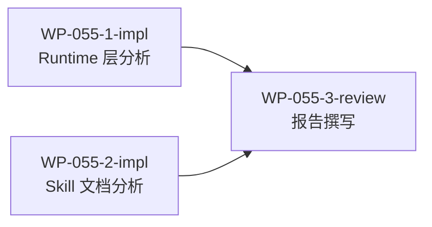

# WP-055: WP-999+ 编号兼容性全面分析

## 🤖 Subagent 读取指令

> **重要**: 此文档包含完整的任务上下文。执行前请阅读以下内容：
> - **问题分析**: 理解 WP 编号超过 999 时的潜在兼容性风险
> - **实施计划**: 按 Step 顺序执行各子工作包
> - **关键文件**: 需要分析的文件列表
> - **验收标准**: 任务完成的检查清单

## 基本信息

| 属性 | 值 |
|------|-----|
| **优先级** | P1 |
| **预估AI时间** | 25min |
| **拆分模式** | standard |
| **状态** | ✅ 完成 |

## 复杂度评估

| 维度 | 评分 | 说明 |
|------|------|------|
| 文件影响范围 | 3 | 需分析 10+ 文件（3 个 validator/provider JS + 6+ skill.md + CLI + 测试） |
| 模块数量 | 3 | 涉及 validator、provider、skill、CLI 多个模块 |
| 接口变更程度 | 1 | 纯分析任务，无代码变更 |
| 测试用例预估 | 1 | 文档任务，无需测试 |
| 预估AI时间 | 2 | 总计约 20-30 分钟 |
| **总分** | **10** | **standard 模式** |

## 子工作包列表

| ID | 类型 | 职责 | 依赖 | 执行角色 | 状态 |
|----|------|------|------|----------|------|
| WP-055-1-impl | 实现 | Runtime 层代码分析（正则、排序、验证、状态存储） | - | 领域专家 | ✅ |
| WP-055-2-impl | 实现 | Skill 文档层分析（创建/拆分/进度/调度 skill.md） | - | 领域专家 | ✅ |
| WP-055-3-review | 审查 | 报告撰写：汇编所有发现，输出分析报告到 docs/reports/ | WP-055-1-impl, WP-055-2-impl | architect | ✅ |

## 依赖关系图

## 目标

分析 Tackle Harness 中所有涉及工作包编号（WP-XXX）的流程，评估当编号超过 WP-999 时的兼容性风险，包括：

1. **正则匹配兼容性** - `/WP-\d+/` 等模式是否正确匹配 4+ 位数字
2. **字符串排序问题** - WP-1000 < WP-999 的字典序错乱
3. **文件命名冲突** - docs/wp/ 目录下的文件排序和查找
4. **数值截断/溢出** - parseInt 等数值操作是否有上限
5. **UI 显示异常** - markdown 表格中 4 位编号的对齐问题
6. **Skill 文档中的隐式约束** - 模板和示例中的 3 位数字假设

## 验收标准

- [x] 所有涉及 WP 编号的 JS 代码文件均已分析
- [x] 所有涉及 WP 编号的 skill.md 文件均已分析
- [x] 报告包含完整的受影响功能点列表
- [x] 每个风险点有具体代码位置引用
- [x] 每个风险有建议修复方案
- [x] 报告已写入 `docs/reports/wp-999-compatibility-analysis.md`
