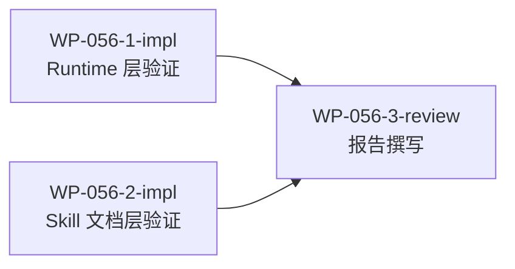

# WP-056: WP-999 兼容性分析报告验证

## 🤖 Subagent 读取指令

> **重要**: 此文档包含完整的任务上下文。执行前请阅读以下内容：
> - **问题分析**: 理解任务的背景和问题点
> - **实施计划**: 按 Step 顺序执行
> - **关键文件**: 需要验证的文件列表
> - **验收标准**: 任务完成的检查清单

## 基本信息

| 属性 | 值 |
|------|-----|
| **优先级** | P1 |
| **预估AI时间** | 30min |
| **拆分模式** | standard |
| **状态** | ✅ 完成 (2026-05-22) |

## 复杂度评估

| 维度 | 评分 | 说明 |
|------|------|------|
| 文件影响范围 | 2 | 涉及 6+ skill.md + 3 JS 文件，需逐文件验证 |
| 模块数量 | 2 | runtime 层 + skill 文档层 |
| 接口变更程度 | 1 | 无代码变更，纯文档验证 |
| 测试用例预估 | 1 | 无需测试 |
| 预估AI时间 | 2 | 每个 sub-WP 约 10-15min |
| **总分** | **8** | 模式: standard |

## 子工作包列表

| ID | 类型 | 职责 | 依赖 | 执行角色 | 状态 |
|----|------|------|------|----------|------|
| WP-056-1-impl | 实现 | Runtime 层验证（JS 正则/排序/数值处理） | - | 领域专家 | 📋 |
| WP-056-2-impl | 实现 | Skill 文档层验证（显式约束/隐式暗示/示例模式） | - | 领域专家 | 📋 |
| WP-056-3-review | 审查 | 汇总验证结论，撰写最终验证报告 | WP-056-1-impl, WP-056-2-impl | code-reviewer | ✅ |

## 依赖关系图

## 目标

对 `docs/reports/wp-999-compatibility-analysis.md`（WP-055 输出物）的结论进行独立验证，判断：
1. 风险评级（High/Medium/Low/None）是否准确
2. 行号引用是否对应实际文件内容
3. 修复建议是否合理充分
4. 是否有遗漏的风险点

最终输出验证报告到 `docs/reports/wp-999-report-verification.md`。

## 背景

WP-055 分析了 Tackle Harness 在工作包编号超过 WP-999 时的兼容性风险，结论为：
- Runtime 层整体安全（正则用 `\d+`，WP ID 全字符串处理）
- Skill 文档层有 1 处高风险（`skill-split-work-package` 显式三位约束）
- 多处 Medium/Low 风险来自示例和模板的隐式暗示

本工作包对这些结论进行逐项验证。

## 验收标准

- [ ] 每个报告结论都有明确的验证结果（✅/⚠️/❌）
- [ ] 行号引用全部经过实际文件核对
- [ ] 验证报告输出到 `docs/reports/wp-999-report-verification.md`
- [ ] 发现的新问题（如子任务编号前导零）有记录
- [ ] 对原报告修复建议给出合理性评价
