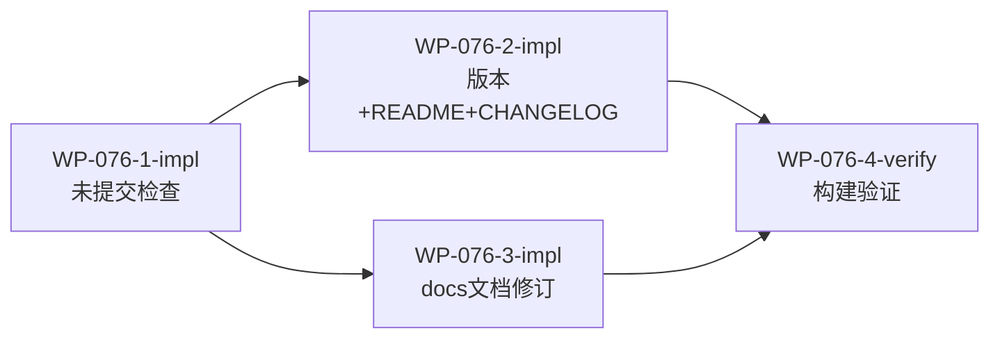

# WP-076: 发布前检查与文档同步

## 🤖 Subagent 读取指令

> **重要**: 此文档包含完整的任务上下文。执行前请阅读以下内容：
> - **问题分析**: 理解任务的背景和问题点
> - **实施计划**: 按 Step 顺序执行
> - **关键文件**: 需要修改的文件列表
> - **验收标准**: 任务完成的检查清单

## 基本信息

| 属性 | 值 |
|------|-----|
| **优先级** | P1 |
| **预估AI时间** | 20min |
| **拆分模式** | standard |
| **状态** | ✅ 完成 |

## 复杂度评估

| 维度 | 评分 | 说明 |
|------|------|------|
| 文件影响范围 | 3 | >10 个文件 |
| 模块数量 | 2 | 版本管理 + 文档同步 |
| 接口变更程度 | 1 | 无接口变更，纯文档 |
| 测试用例预估 | 1 | 仅运行现有测试 |
| 预估AI时间 | 2 | 15-25min |
| **总分** | **9** | 模式: standard |

## 子工作包列表

| ID | 类型 | 职责 | 依赖 | 执行角色 | 状态 |
|----|------|------|------|----------|------|
| WP-076-1-impl | 实现 | 未提交内容检查与修复 | - | implementer | 📋 |
| WP-076-2-impl | 实现 | 版本号升级 + CHANGELOG + README | WP-076-1-impl | implementer | 📋 |
| WP-076-3-impl | 实现 | docs/ 技术文档批量修订 | WP-076-1-impl | implementer | 📋 |
| WP-076-4-verify | 验证 | 构建验证与测试 | WP-076-2-impl, WP-076-3-impl | tester | 📋 |

## 依赖关系图

## 目标

全面检查当前未提交到远程仓库的内容，修复文档与代码的不一致问题，完成版本号升级（0.1.1 → 0.1.2），同步更新 CHANGELOG、README 和 docs/ 目录下的技术文档。

## 问题分析

### A. 未提交内容（需检查是否有问题）
1. `plugins/core/provider-watchdog/assets/daemon-config.template.json` - 守护进程配置模板修改
2. `plugins/core/skill-agent-dispatcher/skill.md` - Agent Dispatcher 技能文档更新
3. `task.md` - 任务管理文档更新

### B. README 问题
- `README.md` L185: "13 个技能" → 应为 "15 个技能"
- `README.md` L278-282: 交互式模式描述重复（与 L270-276 内容相同）
- 两个 README 版本徽章需更新为 0.1.2

### C. docs/ 技术文档问题
| 文件 | 问题 |
|------|------|
| `best-practices.md` L4 | 版本 "0.0.21" 需更新 |
| `best-practices.md` L359 | `tackle-harness@0.0.21` 需更新 |
| `daily-workflow-guide.md` L4 | 版本 "0.0.14" 需更新 |
| `daily-workflow-guide.md` L543-558 | Skill 速查表缺少 tackle-sync 和 task-archive |
| `installation.md` L422 | "tackle-init" 应为 "tackle-sync"（v0.1.0 已改名） |
| `plugin-development.md` L5 | "v0.0.24" 需更新 |
| `ai_workflow.md` L3 | "3.0.0" 需更新 |
| `config-reference.md` | 需检查版本引用 |

### D. 版本与发布
- `package.json`: 0.1.1 → 0.1.2
- `CHANGELOG.md`: 需新增 [0.1.2] 条目

## 验收标准

- [ ] 未提交文件问题已修复（如有）
- [ ] package.json 版本号为 0.1.2
- [ ] CHANGELOG.md 包含 [0.1.2] 条目
- [ ] README.md 无 "13 个技能" 错误、无重复段落
- [ ] docs/ 所有文档版本引用已更新
- [ ] installation.md 中 tackle-init 已改为 tackle-sync
- [ ] daily-workflow-guide.md Skill 速查表包含全部 15 个技能
- [ ] 构建和测试全部通过
