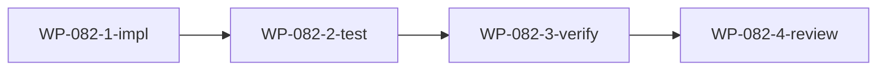

# WP-082: 外部插件加载机制

## 🤖 Subagent 读取指令

> **重要**: 此文档包含完整的任务上下文。执行前请阅读以下内容：
> - **问题分析**: 理解任务的背景和问题点
> - **实施计划**: 按 Step 顺序执行
> - **关键文件**: 需要修改的文件列表
> - **验收标准**: 任务完成的检查清单

## 基本信息

| 属性 | 值 |
|------|-----|
| **优先级** | P0 |
| **预估AI时间** | 55min |
| **拆分模式** | standard |
| **依赖** | WP-086 |
| **状态** | ✅ 完成 |

## 复杂度评估

| 维度 | 评分 | 说明 |
|------|------|------|
| 文件影响范围 | 3 | plugin-loader, manifest-resolver, harness-build, registry |
| 模块数量 | 3 | 加载器、解析器、构建器 |
| 接口变更程度 | 3 | 新增 sourceType 字段 |
| 测试用例预估 | 3 | npm/local/core/invalid 多种路径测试 |
| 预估AI时间 | 3 | 55min |
| **总分** | 15 | 模式: standard |

## 子工作包列表

| ID | 类型 | 职责 | 依赖 | 执行角色 | 状态 |
|----|------|------|------|----------|------|
| WP-082-1-impl | 实现 | 外部插件加载核心实现 | WP-086 | implementer | 📋 |
| WP-082-2-test | 测试 | 路径解析 + 加载测试 | WP-082-1-impl | tester | 📋 |
| WP-082-3-verify | 验证 | 回归测试验证 | WP-082-2-test | tester | 📋 |
| WP-082-4-review | 审查 | 代码审查 | WP-082-3-verify | reviewer | 📋 |

## 依赖关系图

## 目标

支持 tackle 从 npm 包和本地路径加载外部插件，扩展插件注册表格式。

## 问题分析

- 当前仅支持 `core/` 内置插件
- 注册表无 `sourceType` 区分，路径硬编码
- 需要支持 npm 包和本地路径两种外部来源

## 实施计划

### Step 1: 扩展 Registry 格式

`plugins/plugin-registry.json` entry 增加 `sourceType` 字段:
- `core` — 内置插件 (默认，向后兼容)
- `npm` — npm 包插件
- `local` — 本地路径插件

### Step 2: npm source 加载

- 使用 `require.resolve(packageName)` 定位入口
- 支持包名 + 子路径

### Step 3: local source 加载

- 支持绝对路径
- 支持相对于项目根目录的相对路径

### Step 4: manifest-resolver 扩展

- 增加外部来源的扫描与合并逻辑
- 外部插件执行相同的 manifest 验证

### Step 5: harness-build 适配

- 构建流程对外部插件执行相同验证
- 输出到 `.claude/` 目录

### Step 6: 编写插件包约定文档

产出 `docs/plugin-package-convention.md`，定义 `tackle-plugin-*` 包的目录结构约定。

## 关键文件

- `plugins/runtime/plugin-loader.js` — 核心修改
- `plugins/runtime/manifest-resolver.js` — 扩展扫描
- `plugins/runtime/harness-build.js` — 构建适配
- `plugins/runtime/resolve-plugin-path.js` — 路径解析 (WP-086 产出)
- `plugins/plugin-registry.json` — 格式扩展
- `docs/plugin-package-convention.md` — 新建

## 验收标准

- [x] core 插件正常加载 (回归无影响)
- [x] 可通过 registry 配置加载 npm 插件
- [x] 可通过 registry 配置加载本地路径插件
- [x] 无效 source 给出明确错误信息
- [x] 路径解析有单元测试覆盖
- [x] 产出 `docs/plugin-package-convention.md`

## 完成记录

- **完成日期**: 2026-05-29
- **修改文件**:
  - `plugins/runtime/resolve-plugin-path.js` — 扩展 sourceType 支持 npm/local/core 三种来源，新增 resolveNpmPath() 和 findPackageRoot()
  - `plugins/runtime/plugin-loader.js` — _loadPlugin() 传递 sourceType，捕获路径解析错误
  - `plugins/runtime/manifest-resolver.js` — resolveEffectivePlugins() 合并时保留 sourceType 字段
  - `plugins/runtime/harness-build.js` — _buildPlugin() 捕获路径解析错误
  - `docs/plugin-package-convention.md` — 新建插件包约定文档
- **新增测试**: 10 个 (5 resolve-plugin-path + 5 plugin-loader external loading)
- **全量测试**: 280 通过，0 失败
