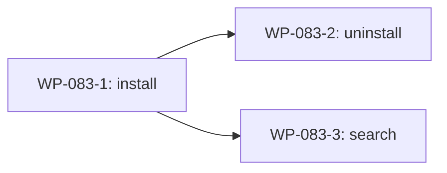

# WP-083: 插件发现与安装

## 🤖 Subagent 读取指令

> **重要**: 此文档包含完整的任务上下文。执行前请阅读以下内容：
> - **问题分析**: 理解任务的背景和问题点
> - **实施计划**: 按 Step 顺序执行
> - **关键文件**: 需要修改的文件列表
> - **验收标准**: 任务完成的检查清单

## 基本信息

| 属性 | 值 |
|------|-----|
| **优先级** | P0 |
| **预估AI时间** | 90min |
| **拆分模式** | fine-grained (功能拆分) |
| **依赖** | WP-082, WP-085 |
| **状态** | 📋 待执行 |

## 复杂度评估

| 维度 | 评分 | 说明 |
|------|------|------|
| 文件影响范围 | 3 | 3 个新命令 + plugin-loader + registry |
| 模块数量 | 3 | install/uninstall/search |
| 接口变更程度 | 3 | 新增 3 个 CLI 命令 |
| 测试用例预估 | 3 | 15+ 测试用例 |
| 预估AI时间 | 3 | 90min |
| **总分** | 16 | 模式: fine-grained |

## 子工作包列表

| ID | 类型 | 职责 | 依赖 | 预估时间 | 状态 |
|----|------|------|------|----------|------|
| WP-083-1 | install 命令 | npm install + registry 注册 | WP-082, WP-085 | 40-45min | 📋 |
| WP-083-2 | uninstall 命令 | 依赖检查 + npm uninstall + 清理 | WP-083-1 | 25-30min | 📋 |
| WP-083-3 | search 命令 | npm registry 搜索 | WP-083-1 | 15-20min | 📋 |

## 依赖关系图

## 目标

为 CLI 添加 `install` / `uninstall` / `search` 命令，支持从 npm 安装外部插件。

## 问题分析

- 依赖 WP-085 (CLI 模块化) 完成后才能添加新命令
- 依赖 WP-082 (外部插件加载) 完成后才能使用外部插件
- 需要处理 npm 操作的网络不稳定性

## 实施计划

### Step 1: install 命令 (WP-083-1)

- npm install + registry 注册 + manifest 更新
- dry-run 模式支持
- 网络错误重试机制

### Step 2: uninstall 命令 (WP-083-2)

- 依赖检查 (其他插件是否依赖)
- npm uninstall + registry 清理
- 确认提示

### Step 3: search 命令 (WP-083-3)

- 按 `tackle-plugin-*` 前缀搜索 npm registry
- registry 源切换支持
- 结果格式化输出

## 关键文件

- `commands/install.js` — 新建
- `commands/uninstall.js` — 新建
- `commands/search.js` — 新建
- `plugins/runtime/plugin-loader.js` — 配合安装流程
- `plugins/plugin-registry.json` — 动态更新

## 验收标准

- [ ] `tackle install tackle-plugin-xxx` 成功安装并注册
- [ ] `tackle uninstall tackle-plugin-xxx` 成功卸载并清理
- [ ] 依赖检查阻止卸载被依赖的插件
- [ ] 网络错误有重试机制
- [ ] dry-run 模式正确预览操作
- [ ] `tackle search` 按 `tackle-plugin-*` 前缀搜索
