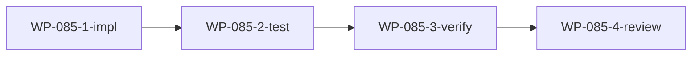

# WP-085: CLI 模块化重构

## 🤖 Subagent 读取指令

> **重要**: 此文档包含完整的任务上下文。执行前请阅读以下内容：
> - **问题分析**: 理解任务的背景和问题点
> - **实施计划**: 按 Step 顺序执行
> - **关键文件**: 需要修改的文件列表
> - **验收标准**: 任务完成的检查清单

## 基本信息

| 属性 | 值 |
|------|-----|
| **优先级** | P0 (前置) |
| **预估AI时间** | 60min |
| **拆分模式** | standard |
| **状态** | ✅ 完成 (2026-05-29) |

## 复杂度评估

| 维度 | 评分 | 说明 |
|------|------|------|
| 文件影响范围 | 3 | tackle.js + commands/*.js |
| 模块数量 | 3 | CLI 入口 + 命令模块 |
| 接口变更程度 | 2 | 内部重构，接口不变 |
| 测试用例预估 | 3 | 9 个子命令需回归测试 |
| 预估AI时间 | 3 | 60min |
| **总分** | 15 | 模式: standard |

## 子工作包列表

| ID | 类型 | 职责 | 依赖 | 执行角色 | 状态 |
|----|------|------|------|----------|------|
| WP-085-1-impl | 实现 | 拆分 tackle.js 为 commands/*.js | - | implementer | 📋 |
| WP-085-2-test | 测试 | CLI 集成测试 | WP-085-1-impl | tester | 📋 |
| WP-085-3-verify | 验证 | 回归测试验证 | WP-085-2-test | tester | 📋 |
| WP-085-4-review | 审查 | 代码审查 | WP-085-3-verify | reviewer | 📋 |

## 依赖关系图



## 目标

将 `bin/tackle.js` (1,623 行单文件) 拆分为 `commands/*.js` 子命令模块结构，主入口仅做参数解析 + 命令路由分发。

## 问题分析

- `bin/tackle.js` 有 1,623 行，包含所有子命令实现
- 新增命令会持续加剧单文件膨胀
- CLI 架构需要模块化以支持 WP-083 (新增 install/uninstall/search 命令)

## 实施计划

### Step 1: 设计命令模块接口

每个命令模块导出统一接口：
```javascript
module.exports = {
  name: 'build',
  description: '...',
  execute(context) { /* ... */ }
};
```

`context` 对象包含：args, options, cwd, config, exit(code) 等。

### Step 2: 创建 commands/ 目录

逐个拆分子命令文件：
- `commands/build.js`
- `commands/validate.js`
- `commands/init.js`
- `commands/migrate.js`
- `commands/interactive.js`
- `commands/status.js`
- `commands/config.js`
- `commands/list.js`
- `commands/version.js`

### Step 3: 重构主入口

`tackle.js` 仅保留：
- 参数解析 (yargs 或手动)
- 命令路由分发
- 全局选项处理

### Step 4: 验证回归

确保所有现有命令行为不变。

## 关键文件

- `bin/tackle.js` — 重构为轻量路由入口
- `commands/*.js` — 新建 9 个命令模块
- `bin/context.js` — 新建，命令执行上下文

## 验收标准

- [ ] 所有现有命令功能不变 (build/validate/init/migrate/interactive/status/config/list/version)
- [ ] `node bin/tackle.js build` / `validate` / `init` 等行为一致
- [ ] 新命令可通过添加 `commands/xxx.js` 文件接入
- [ ] 164 测试全通过
- [ ] tackle.js 主入口 ≤ 200 行
