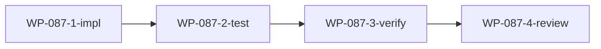

# WP-087: 性能监控与诊断模块

## 🤖 Subagent 读取指令

> **重要**: 此文档包含完整的任务上下文。执行前请阅读以下内容：
> - **问题分析**: 理解任务的背景和问题点
> - **实施计划**: 按 Step 顺序执行
> - **关键文件**: 需要修改的文件列表
> - **验收标准**: 任务完成的检查清单

## 基本信息

| 属性 | 值 |
|------|-----|
| **优先级** | P3 (可选) |
| **预估AI时间** | 25min |
| **拆分模式** | standard |
| **依赖** | 无 |
| **状态** | 📋 可选 |

## 复杂度评估

| 维度 | 评分 | 说明 |
|------|------|------|
| 文件影响范围 | 2 | 新建 performance-monitor.js |
| 模块数量 | 2 | 性能监控 + EventBus 集成 |
| 接口变更程度 | 2 | 新增监控 API |
| 测试用例预估 | 3 | 多个监控场景测试 |
| 预估AI时间 | 2 | 25min |
| **总分** | 13 | 模式: standard |

## 子工作包列表

| ID | 类型 | 职责 | 依赖 | 执行角色 | 状态 |
|----|------|------|------|----------|------|
| WP-087-1-impl | 实现 | 性能监控模块实现 | - | implementer | 📋 |
| WP-087-2-test | 测试 | 单元测试 | WP-087-1-impl | tester | 📋 |
| WP-087-3-verify | 验证 | 测试验证 | WP-087-2-test | tester | 📋 |
| WP-087-4-review | 审查 | 代码审查 | WP-087-3-verify | reviewer | 📋 |

## 依赖关系图

## 目标

新建 `performance-monitor.js`，非侵入式监控插件加载/激活耗时。

## 问题分析

- CLI 非常驻进程，性能数据 ROI 极低
- 仅在多个用户明确有需求时实施
- 当前标记为 P3 可选

## 实施计划

### Step 1: 创建性能监控模块

新建 `plugins/runtime/performance-monitor.js`：
- 事件驱动: 监听 EventBus `plugin.activated` / `plugin.deactivated` 事件
- 记录每次插件操作的 duration
- 不侵入 PluginLoader 代码

### Step 2: 提供 API

- 查询性能数据 (平均耗时、最慢插件、历史趋势)
- 性能数据可序列化导出 (JSON)

### Step 3: 集成日志

- 与 `logger.js` 集成，记录性能数据

## 关键文件

- `plugins/runtime/performance-monitor.js` — 新建
- `plugins/runtime/event-bus.js` — 事件消费
- `plugins/runtime/logger.js` — 集成日志

## 验收标准

- [ ] 插件激活/停用自动记录耗时
- [ ] 可查询各插件性能数据
- [ ] 不影响现有插件加载流程
- [ ] 性能数据可 JSON 导出
