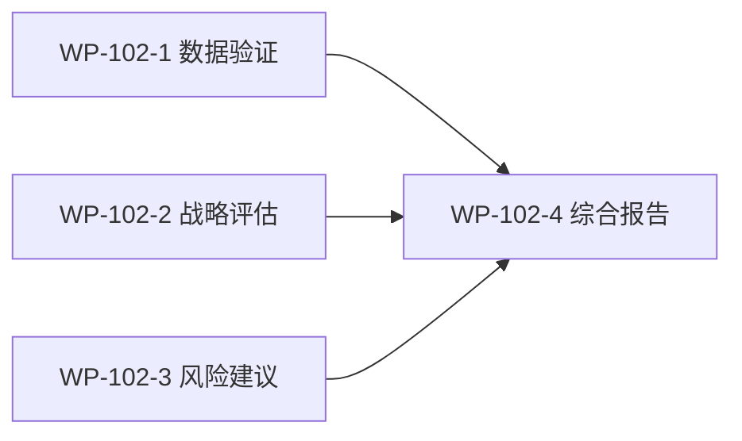

# WP-102: v0.2.0 路线图全局评估专业审查报告

## 🤖 Subagent 读取指令

> **重要**: 此文档包含完整的任务上下文。执行前请阅读以下内容：
> - **问题分析**: 评估报告存在数据偏差，需独立验证后给出专业建议
> - **实施计划**: 按 WP-102-1/2/3 并行执行，WP-102-4 汇总
> - **关键文件**: 评估报告、路线图、核心运行时代码
> - **验收标准**: 每项建议有具体技术依据，非泛泛而谈

## 基本信息

| 属性 | 值 |
|------|-----|
| **优先级** | P0 |
| **预估AI时间** | 25-35min |
| **拆分模式** | standard |
| **状态** | ✅ 完成 |

## 复杂度评估

| 维度 | 评分 | 说明 |
|------|------|------|
| 文件影响范围 | 2 | 需读取 3-5 个核心源文件 + 评估报告 + 路线图 |
| 模块数量 | 2 | 数据验证 + 专业分析 |
| 接口变更程度 | 1 | 无代码变更，纯文档输出 |
| 测试用例预估 | 1 | 无需测试 |
| 预估AI时间 | 2 | 25-35min |
| **总分** | **8** | 模式: standard |

## 子工作包列表

| ID | 类型 | 职责 | 依赖 | 执行角色 | 状态 |
|----|------|------|------|----------|------|
| WP-102-1-impl | 实现 | 数据准确性验证与校准 | - | architect | ✅ |
| WP-102-2-impl | 实现 | 战略方向与技术路线评估 | - | architect | ✅ |
| WP-102-3-impl | 实现 | 风险评估与实施建议 | - | architect | ✅ |
| WP-102-4-review | 审查 | 综合报告整合与输出 | WP-102-1, 2, 3 | architect | ✅ |

## 依赖关系图

## 目标

对 `docs/reports/2026-05-25_roadmap-global-assessment.md` 进行独立的专业审查，从架构师角度：

1. **验证数据准确性** - 逐项核实评估报告的核心数据声明
2. **评估战略方向** - 判断路线图方向、优先级和技术选型是否合理
3. **审查风险矩阵** - 验证风险评级，补充遗漏风险
4. **给出可操作建议** - 每条建议有具体执行步骤

## 背景

v0.2.0 路线图包含 19+1 可选 WP，分 4 Phase，原估算 480min。WP-078~081 已完成可行性分析，产出了全局综合评估报告（Conditional-Go 结论）。用户要求独立审查该评估报告的专业性。

### 代码级验证发现的关键数据偏差

| 指标 | 评估报告声称 | 实际验证值 | 偏差 |
|------|------------|-----------|------|
| harness-build.js 方法数 | 148 | ~42 (含箭头函数) | **3.5x 高估** |
| 全局方法总数 | 463 | ~105 (10个运行时文件) | **4.4x 高估** |
| 测试数量 | 同时出现 164 和 214 | **164** (实际运行) | R15 不成立 |
| JSDoc 覆盖率 | 18% (83/379) | harness-build.js 单文件 80 处 | 需重新统计 |
| package-lock.json 版本 | 未具体说明 | 0.0.11 vs 0.1.2 | **落后 6 版本** |

## 验收标准

- [ ] 所有子工作包完成
- [ ] 数据偏差 >20% 的项有详细修正说明
- [ ] 每条建议有具体技术依据（代码行号/文件路径）
- [ ] 反对意见提供替代方案
- [ ] 综合报告结构清晰，结论可追溯
- [ ] 输出 4 份报告到 docs/reports/
