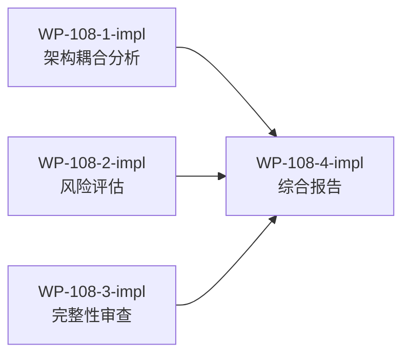

# WP-108: Harness Roadmap 可行性分析

## 🤖 Subagent 读取指令

> **重要**: 此文档包含完整的任务上下文。执行前请阅读以下内容：
> - **问题分析**: 理解任务的背景和问题点
> - **实施计划**: 按 Step 顺序执行
> - **关键文件**: 需要修改的文件列表
> - **验收标准**: 任务完成的检查清单

## 基本信息

| 属性 | 值 |
|------|-----|
| **优先级** | P1 |
| **预估AI时间** | 40min |
| **拆分模式** | fine-grained |
| **状态** | ✅ 完成 |

## 复杂度评估

| 维度 | 评分 | 说明 |
|------|------|------|
| 文件影响范围 | 2 | 需读取报告、registry、runtime 多个文件，输出 1 份报告 |
| 模块数量 | 3 | 涉及 build pipeline、plugin system、CLI、runtime 多模块 |
| 接口变更程度 | 1 | 纯分析任务，无代码变更 |
| 测试用例预估 | 1 | 分析任务无需测试 |
| 预估AI时间 | 3 | 多维度深度分析，预估 >30min |
| **总分** | **10** | 模式: fine-grained |

## 子工作包列表

| ID | 类型 | 职责 | 依赖 | 执行角色 | 状态 |
|----|------|------|------|----------|------|
| WP-108-1-impl | 实现 | 架构耦合与抽象可行性分析 | - | architect | ✅ |
| WP-108-2-impl | 实现 | 技术债务影响与风险评估 | - | architect | ✅ |
| WP-108-3-impl | 实现 | 方案完整性与落地性审查 | - | architect | ✅ |
| WP-108-4-impl | 实现 | 综合可行性报告撰写 | WP-108-1, WP-108-2, WP-108-3 | documenter | ✅ |

## 依赖关系图

## 目标

分析 `docs/reports/report-2026-05-29-harness-roadmap.md` 中提出的方案，评估将当前项目改造为通用 harness 插件的可行性，具体关注：

1. **方案能否达成通用插件的期望** — 当前与 Claude Code 的耦合程度是否可解耦
2. **实施过程是否存在技术或架构障碍** — 具体阻塞点在哪里
3. **方案的完整性和可落地性** — 是否有遗漏或过度设计

最终输出明确的可行性判断（可行 / 有条件可行 / 不可行）和潜在风险点，报告写入 `docs/reports/` 目录。

## 问题分析

### 背景

当前 tackle-harness v0.1.2 是一个面向 Claude Code 的 AI Agent 工作流框架，包含 23 个插件、11 个运行时模块。Roadmap 报告提出将其改造为"AI Agent 工程平台"——一个拥有稳定契约、质量保障、开发者体验和演进治理的通用生态系统。

### 核心问题

- **耦合度**: `harness-build.js` 硬编码了 `.claude/skills/`、`.claude/hooks/`、`.claude/settings.json` 等 Claude Code 特有路径和格式
- **成熟度差距**: 平均成熟度 1.625/5，与平台目标 4.0/5 差距巨大
- **生态为零**: 当前无外部插件，无安装/搜索/卸载机制
- **安全缺失**: 无威胁模型、无沙箱、无权限审计

## 实施计划

### Step 1: 架构耦合与抽象可行性分析 (WP-108-1-impl)

分析当前代码与 Claude Code 的耦合点，评估抽象方案可行性。

**关键文件**:
- `plugins/runtime/harness-build.js` — 构建管道，硬编码 Claude Code 输出格式
- `plugins/runtime/plugin-loader.js` — 插件加载，生命周期管理
- `plugins/runtime/manifest-resolver.js` — 清单解析
- `plugins/plugin-registry.json` — 插件注册表
- `bin/tackle.js` — CLI 入口

**分析维度**:
- 目录结构耦合（`.claude/` 路径）
- 文件格式耦合（skill.md、settings.json hook 格式）
- 运行时耦合（Claude Code hooks 事件名）
- 构建管道耦合（输出格式硬编码）

**结论要求**: 对每个耦合点给出"可解耦 / 需重构 / 不可解耦"三级评估

### Step 2: 技术债务影响与风险评估 (WP-108-2-impl)

基于报告中的债务地图和成熟度评估，分析对平台化目标的影响。

**分析对象**:
- 报告 Section III（技术债务地图）
- 报告 Section II（工程成熟度评估）

**分析维度**:
- harness-build.js 1546 行单体文件的影响
- 295 测试覆盖不足的风险
- CI 仅 Linux 的跨平台障碍
- 无安全模型的平台化风险
- 无可观测性的运维风险

**结论要求**: 每个风险给出"阻塞 / 高风险 / 中风险 / 低风险"四级标签 + 缓解策略

### Step 3: 方案完整性与落地性审查 (WP-108-3-impl)

审查四阶段路线图的完整性和可实施性。

**分析对象**:
- 报告 Section IV（工程演进路线图）
- 报告 Section VII（生态工程）
- 报告 Section V（质量体系建设）

**分析维度**:
- 各阶段里程碑是否合理
- 时间估算是否现实
- 是否有遗漏维度（如向后兼容、迁移路径）
- 是否有过度设计（如 v1.0.0 的插件市场）
- 从 v0.1.2 → v0.2.0 → v1.0.0 的路径是否可落地

**结论要求**: 对每个维度给出"缺失 / 过度设计 / 合理"标注 + 建议

### Step 4: 综合可行性报告撰写 (WP-108-4-impl)

汇总前三项分析结果，撰写最终可行性报告。

**输出文件**: `docs/reports/report-2026-05-29-harness-roadmap-feasibility.md`

**内容结构**:
1. 执行摘要（可行性结论）
2. 架构可行性评估
3. 风险矩阵
4. 方案缺口分析
5. 实施建议与优先级
6. 附录：详细分析数据

## 关键文件

### 必读文件
- `docs/reports/report-2026-05-29-harness-roadmap.md` — 待分析的路由图报告
- `plugins/runtime/harness-build.js` — 核心构建模块
- `plugins/runtime/plugin-loader.js` — 插件加载器
- `plugins/plugin-registry.json` — 插件注册表

### 参考文件
- `plugins/runtime/manifest-resolver.js` — 清单解析
- `bin/tackle.js` — CLI 入口
- `plugins/contracts/plugin-interface.js` — 插件接口定义
- `docs/design/roadmap-v0.2.0.md` — 战术路线图（报告中引用）

## 验收标准

- [x] 所有子工作包完成
- [x] 综合可行性报告已写入 `docs/reports/`
- [x] 报告包含明确的可行性判断（可行 / 有条件可行 / 不可行）
- [x] 每个耦合点有三级评估标注
- [x] 每个风险有四级标签 + 缓解策略
- [x] 方案缺口有明确的缺失/过度设计/合理标注
- [x] 报告包含可操作的实施建议

## 完成记录

- **完成日期**: 2026-05-29
- **实际工时**: ~15min（4 个子代理并行执行）
- **执行模式**: 3 个 architect 并行分析 + 1 个 documenter 汇总
- **交付物**: `docs/reports/report-2026-05-29-harness-roadmap-feasibility.md`
- **关键结论**: 有条件可行 — 71% 耦合点可解耦，安全模型缺失为阻塞项
