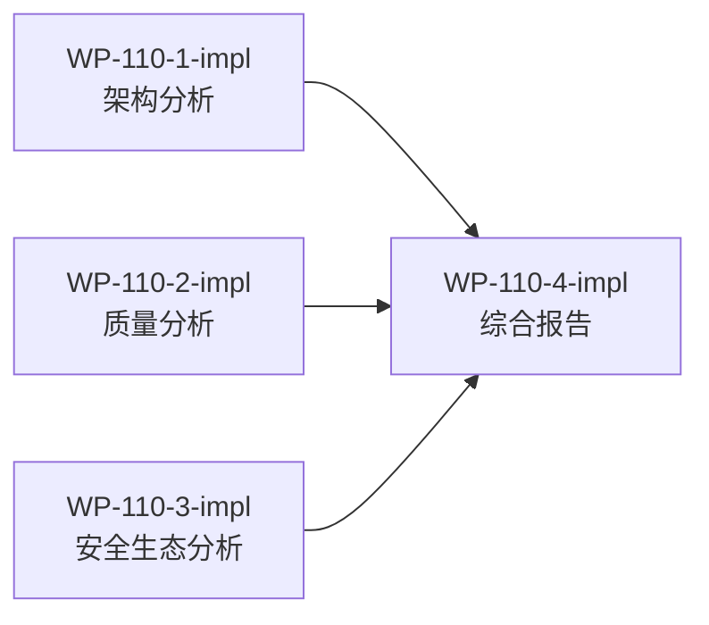

# WP-110: Harness Roadmap 可行性分析报告

## 🤖 Subagent 读取指令

> **重要**: 此文档包含完整的任务上下文。执行前请阅读以下内容：
> - **问题分析**: 理解任务的背景和问题点
> - **实施计划**: 按 Step 顺序执行
> - **关键文件**: 需要分析的文件列表
> - **验收标准**: 任务完成的检查清单

## 基本信息

| 属性 | 值 |
|------|-----|
| **优先级** | P1 |
| **预估AI时间** | 36min |
| **拆分模式** | standard |
| **状态** | ✅ 完成 |

## 背景

`docs/reports/report-2026-05-29-harness-roadmap.md` 提出了 Tackle Harness 从工具到平台的四大阶段演进路线：
- 阶段 I (v0.2.0): 基础工程化 — 成熟度 1.6 → 2.5
- 阶段 II (v0.3.0): 生态使能 — 成熟度 2.5 → 3.0
- 阶段 III (v0.4.0): 平台治理 — 成熟度 3.0 → 3.5
- 阶段 IV (v1.0.0): 生态成熟 — 成熟度 3.5 → 4.0

需要从架构、质量、安全、生态等维度评估这些方案的可行性。

## 复杂度评估

| 维度 | 评分 | 说明 |
|------|------|------|
| 文件影响范围 | 1 | 仅输出新报告文件，不修改现有代码 |
| 模块数量 | 2 | 需分析 runtime + plugins 两大模块 |
| 接口变更程度 | 1 | 无代码变更，纯分析任务 |
| 测试用例预估 | 1 | 无需测试用例 |
| 预估AI时间 | 3 | 综合分析需 >30min（684 行报告 + 代码对照） |
| **总分** | **8** | **标准模式** |

## 子工作包列表

| ID | 类型 | 职责 | 依赖 | 执行角色 | 状态 |
|----|------|------|------|----------|------|
| WP-110-1-impl | 分析 | 架构与技术可行性分析 | - | architect | ✅ |
| WP-110-2-impl | 分析 | 质量体系与 CI/CD 可行性分析 | - | tester | ✅ |
| WP-110-3-impl | 分析 | 安全与生态可行性分析 | - | architect | ✅ |
| WP-110-4-impl | 报告 | 综合可行性报告编写 | 1,2,3 | documenter | ✅ |

## 依赖关系图

WP-110-1/2/3 可并行执行，WP-110-4 需等待前三者完成后汇总。

## 目标

对 roadmap 报告进行多维度可行性分析，回答三个核心问题：
1. 方案能否达成做成通用 harness 插件的期望
2. 实施过程中是否存在技术或架构上的障碍
3. 方案的完整性和可落地性如何

最终输出一份明确的可行性判断和潜在风险点报告。

## 验收标准

- [x] WP-110-1/2/3 各输出分析结论（明确可行/风险/障碍）
- [x] WP-110-4 输出完整报告到 `docs/reports/`
- [x] 报告包含明确的总体可行性判断（可行/有条件可行/不可行）
- [x] 报告包含风险矩阵（概率 × 影响）和优先级排序
- [x] 所有发现基于代码事实而非假设

## 关键文件

### 输入（分析对象）
- `docs/reports/report-2026-05-29-harness-roadmap.md` — Roadmap 报告（684 行）
- `plugins/runtime/harness-build.js` — 构建系统
- `plugins/contracts/plugin-interface.js` — 插件接口
- `plugins/runtime/plugin-loader.js` — 插件加载器
- `plugins/runtime/manifest-resolver.js` — Manifest 解析器
- `plugins/runtime/resolve-plugin-path.js` — 外部插件路径解析
- `plugins/plugin-registry.json` — 插件注册表
- `bin/tackle.js` — CLI 入口
- `package.json` — 项目元数据
- `.github/workflows/ci.yml` — CI 配置
- `test/` — 测试目录

### 输出
- `docs/reports/report-2026-05-29-roadmap-feasibility-analysis.md` — 最终报告
