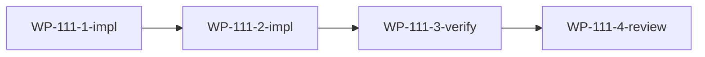

# WP-111: Harness 通用化最终方案设计

## 🤖 Subagent 读取指令

> **重要**: 此文档包含完整的任务上下文。执行前请阅读以下内容：
> - **问题分析**: 理解两份可行性报告的综合结论
> - **实施计划**: 按 Step 顺序执行
> - **关键文件**: 需要读取的分析文档
> - **验收标准**: 任务完成的检查清单

## 基本信息

| 属性 | 值 |
|------|-----|
| **优先级** | P1 |
| **预估AI时间** | 65min |
| **拆分模式** | standard |
| **状态** | 📋 待执行 |

## 复杂度评估

| 维度 | 评分 | 说明 |
|------|------|------|
| 文件影响范围 | 2 | 读取 4 份报告，输出 1 份设计文档 |
| 模块数量 | 2 | 分析+设计两阶段 |
| 接口变更程度 | 1 | 纯文档，无代码变更 |
| 测试用例预估 | 1 | 无测试 |
| 预估AI时间 | 3 | 总计约 65min |
| **总分** | **9** | standard 模式 |

## 子工作包列表

| ID | 类型 | 职责 | 依赖 | 执行角色 | 状态 |
|----|------|------|------|----------|------|
| WP-111-1-impl | 分析+设计 | 可行性综合分析 + 架构设计 | - | architect | 📋 |
| WP-111-2-impl | 设计文档 | 实施路线图 + 风险治理设计 | WP-111-1-impl | architect | 📋 |
| WP-111-3-verify | 验证 | 文档交叉验证与一致性检查 | WP-111-1-impl, WP-111-2-impl | reviewer | 📋 |
| WP-111-4-review | 审查 | 方案质量审查 | WP-111-3-verify | reviewer | 📋 |

## 依赖关系图

## 背景

### 数据来源

| 文件 | 角色 | 关键内容 |
|------|------|----------|
| `docs/reports/report-2026-05-29-harness-roadmap.md` | 原始战略路线图 | 四阶段演进、八维度成熟度评估、技术债务图谱、质量体系建设、生态工程 |
| `docs/reports/report-2026-05-29-harness-roadmap-feasibility.md` | WP-109 可行性报告 | 成熟度 1.625/5、18 项技术债务、8 项风险、v0.2.0 预算 700min |
| `docs/reports/report-2026-05-29-roadmap-feasibility-analysis.md` | WP-110 可行性报告 | 6 维度架构评估、3 模块零测试、Provider 依赖链断裂、Worker Threads 沙箱推荐 |
| `docs/design/roadmap-v0.2.0.md` | 战术路线图 | 20+1 WP、4 Phase、575-600min 估算 |

### 两份报告结论对比

| 维度 | WP-109 | WP-110 | 共识/分歧 |
|------|--------|--------|-----------|
| 总体结论 | 有条件可行 | 有条件可行 | **共识** |
| 最大阻塞 | 安全模型（1/5 成熟度） | 外部插件任意代码执行（严重） | **共识** |
| 时间估算 | 700min（含缓冲） | 未给总量 | WP-109 更具体 |
| 关键架构障碍 | harness-build.js 单体 | Provider 依赖链断裂 + Manifest 缺失 | **互补** |
| 安全方案 | 未推荐具体技术 | 推荐 Worker Threads 沙箱 | WP-110 更具体 |
| 生态路径 | L2 拆为 L2a/L2b | L0→L1 120-180min | **互补** |
| 治理建议 | 轻量 RFC + 变更记录 | 自动化 API 变更检测 | **共识** |

## 目标

综合 WP-109 和 WP-110 两份独立可行性报告及其原始 roadmap，产出一份最终通用化平台设计方案，包含：

1. **综合可行性裁决** — 交叉验证两报告发现，给出最终判断
2. **架构解耦方案** — 将 Claude Code 特有逻辑抽象为适配层
3. **安全模型设计** — 基于 Worker Threads 的沙箱隔离方案
4. **质量体系建设** — 五层质量金字塔的具体实施路径
5. **生态演进路线** — 修正后的 L0→L4 路径和退出标准
6. **综合风险矩阵** — 合并去重的风险分级和缓解措施
7. **实施路线图** — 修正后的 v0.2.0-v1.0.0 全景规划

## 输出文件

| 文件 | 内容 |
|------|------|
| `docs/design/harness-universal-platform-final-design.md` | 综合最终方案设计文档（单文档） |

## 验收标准

- [ ] 两份报告的核心发现均被综合覆盖
- [ ] 架构解耦方案有具体的模块划分和接口定义
- [ ] 安全模型有具体的技术方案（非仅描述）
- [ ] 路线图包含修正后的时间估算和优先级
- [ ] 风险矩阵涵盖两份报告的所有高风险项
- [ ] 文档内部无矛盾，与原始报告引用一致
- [ ] 单文档结构完整，可独立阅读
