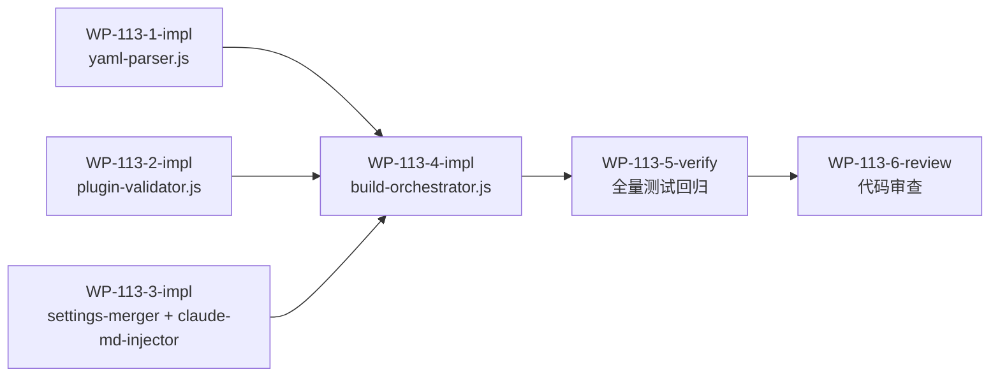

# WP-113: A2 harness-build.js 模块化

## 🤖 Subagent 读取指令

> **重要**: 此文档包含完整的任务上下文。执行前请阅读以下内容：
> - **问题分析**: harness-build.js 1,547 行单体阻塞后续 WP，是多条路线的必经之路
> - **实施方案**: 拆分为 5 个内聚模块 + 精简主模块（proxy pattern 向后兼容）
> - **关键文件**: plugins/runtime/harness-build.js
> - **验收标准**: 任务完成的检查清单

## 基本信息

| 属性 | 值 |
|------|-----|
| **优先级** | P0（阻塞级） |
| **预估AI时间** | 110min |
| **拆分模式** | fine-grained（6 子工作包） |
| **状态** | ✅ 完成 |

## 复杂度评估

| 维度 | 评分 | 说明 |
|------|------|------|
| 文件影响范围 | 3 | 新增 5 个文件，修改 1 个文件 |
| 模块数量 | 3 | 涉及 >3 个模块拆分 |
| 接口变更程度 | 3 | 新增公共接口，需保持向后兼容 |
| 测试用例预估 | 2 | 新增 6-15 个测试 |
| 预估AI时间 | 3 | 总计约 110min |
| **总分** | **14** | fine-grained 模式 |

## 子工作包列表

| ID | 类型 | 职责 | 依赖 | 执行角色 | 状态 |
|----|------|------|------|----------|------|
| WP-113-1-impl | 实现 | Extract yaml-parser.js | - | implementer | ✅ |
| WP-113-2-impl | 实现 | Extract plugin-validator.js | - | implementer | ✅ |
| WP-113-3-impl | 实现 | Extract settings-merger.js + claude-md-injector.js | - | implementer | ✅ |
| WP-113-4-impl | 实现 | Create slim build-orchestrator.js | WP-113-1~3 | architect | ✅ |
| WP-113-5-verify | 验证 | 全量测试回归 | WP-113-4 | tester | ✅ |
| WP-113-6-review | 审查 | 代码审查 | WP-113-5 | reviewer | ✅ |

## 依赖关系图

## 背景

### 数据来源

| 文件 | 角色 | 关键内容 |
|------|------|----------|
| `docs/design/harness-universal-platform-final-design.md` 第 2 章 | 架构解耦方案 | harness-build.js 模块化完整方案 |
| `plugins/runtime/harness-build.js` | 当前代码 | 1,547 行，27 个 prototype 方法，9 个独立私有函数 |

### 问题分析

`harness-build.js` 共 1,547 行，包含 27 个 prototype 方法和 9 个独立私有函数。WP-109 和 WP-110 均识别此为关键阻塞项：

- **WP-109**: R1 阻塞项，"harness-build.js 单体阻塞后续 WP"
- **WP-110**: 维度 1，"有条件可行"，目标 <800 行可达

该文件天然形成 6 个职责域（详见设计文档 2.1.1 节代码结构审计），拆分后每个模块可独立测试和维护。

### 模块划分

| 模块 | 文件 | 预估行数 | 职责 |
|------|------|---------|------|
| yaml-parser.js | `plugins/runtime/yaml-parser.js` | ~150 | YAML 解析 |
| plugin-validator.js | `plugins/runtime/plugin-validator.js` | ~180 | 插件验证 |
| settings-merger.js | `plugins/runtime/settings-merger.js` | ~100 | Settings 合并 |
| claude-md-injector.js | `plugins/runtime/claude-md-injector.js` | ~150 | CLAUDE.md 注入 |
| build-orchestrator.js | `plugins/runtime/build-orchestrator.js` | ~400 | 精简主模块 |

> 注：WP-113-1、WP-113-2、WP-113-3 之间无依赖，可并行执行。

## 目标

将 1,547 行的 `harness-build.js` 拆分为 5 个内聚模块 + 精简主模块，达到以下目标：

1. **主模块 <800 行** — 从 1,547 行降至 ~400 行
2. **向后兼容** — `module.exports` 接口不变，所有现有调用方无需修改
3. **独立可测试** — 每个模块配备独立测试文件
4. **模块间依赖清晰** — 无循环引用

## 关键文件

### 输入（读取）
- `docs/design/harness-universal-platform-final-design.md` 第 2 章 — 架构解耦方案
- `plugins/runtime/harness-build.js` — 源文件（1,547 行）

### 输出（新建）
- `plugins/runtime/yaml-parser.js` — YAML 解析模块（~150 行）
- `plugins/runtime/plugin-validator.js` — 插件验证模块（~180 行）
- `plugins/runtime/settings-merger.js` — Settings 合并模块（~100 行）
- `plugins/runtime/claude-md-injector.js` — CLAUDE.md 注入模块（~150 行）
- `plugins/runtime/build-orchestrator.js` — 精简主模块（~400 行）

### 输出（修改）
- `plugins/runtime/harness-build.js` — 转为 proxy pattern，代理到新模块

## 验收标准

- [ ] 5 个新模块文件创建完成，公共接口有 JSDoc
- [ ] harness-build.js 精简为 proxy pattern，向后兼容
- [ ] 295 测试全部通过（无破坏性变更）
- [ ] 模块间依赖清晰，无循环引用
- [ ] 主模块从 1,547 行降至 ~400 行
