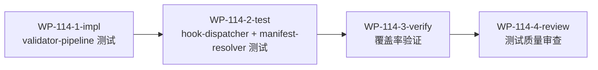

# WP-114: A3 3 模块测试补全

## 🤖 Subagent 读取指令

> **重要**: 此文档包含完整的任务上下文。执行前请阅读以下内容：
> - **问题分析**: 3 个零测试/低覆盖模块共 1,046 行代码，覆盖率 33-47%
> - **实施方案**: 为每个模块编写专属测试，目标覆盖率 70-75%+
> - **关键文件**: validator-pipeline.js, hook-dispatcher.js, manifest-resolver.js
> - **验收标准**: 任务完成的检查清单

## 基本信息

| 属性 | 值 |
|------|-----|
| **优先级** | P0（阻塞级） |
| **预估AI时间** | 90min |
| **拆分模式** | standard（4 子工作包） |
| **状态** | ✅ 完成 |

## 复杂度评估

| 维度 | 评分 | 说明 |
|------|------|------|
| 文件影响范围 | 2 | 新增 3 个测试文件 |
| 模块数量 | 2 | 3 个待测模块 |
| 接口变更程度 | 1 | 无接口变更，仅新增测试 |
| 测试用例预估 | 2 | 新增 30+ 个测试用例 |
| 预估AI时间 | 3 | 总计约 90min |
| **总分** | **10** | standard 模式 |

## 子工作包列表

| ID | 类型 | 职责 | 依赖 | 执行角色 | 状态 |
|----|------|------|------|----------|------|
| WP-114-1-impl | 实现 | 编写 validator-pipeline 测试 | - | tester | 📋 |
| WP-114-2-test | 测试 | 编写 hook-dispatcher + manifest-resolver 测试 | WP-114-1 | tester | 📋 |
| WP-114-3-verify | 验证 | 运行测试，确认覆盖率达标 | WP-114-2 | tester | 📋 |
| WP-114-4-review | 审查 | 测试质量审查 | WP-114-3 | reviewer | 📋 |

## 依赖关系图

## 背景

### 数据来源

| 文件 | 角色 | 关键内容 |
|------|------|----------|
| `docs/design/harness-universal-platform-final-design.md` 第 4.3.2 节 | L2 单元测试补全方案 | 3 模块测试计划和覆盖率目标 |
| `docs/reports/report-2026-05-29-roadmap-feasibility-analysis.md` | WP-110 可行性报告 | 维度 1 代码审计，覆盖盲区详情 |

### 问题分析

WP-110 的代码审计发现 3 个零测试/低覆盖模块，共 1,046 行代码缺乏测试保护：

| 模块 | 行数 | 行覆盖率 | 函数覆盖率 | 影响 |
|------|------|---------|-----------|------|
| `validator-pipeline.js` | 467 | 33.83% | 0% | 验证器编排核心，`tackle validate` 直接依赖 |
| `hook-dispatcher.js` | 309 | 38.19% | 0% | Hook 事件分发，所有 hook 插件的执行路径 |
| `manifest-resolver.js` | 270 | 47.41% | 50% | 项目级插件覆盖逻辑，外部插件管理基础 |

这三个模块合计占运行时代码的 ~25%，零测试意味着任何重构都可能引入未发现的回归。

## 目标

为 3 个零测试/低覆盖模块补充专属测试，达到以下覆盖率目标：

| 模块 | 当前行覆盖率 | 目标行覆盖率 |
|------|------------|------------|
| `validator-pipeline.js` | 33.83% | 75%+ |
| `hook-dispatcher.js` | 38.19% | 70%+ |
| `manifest-resolver.js` | 47.41% | 75%+ |

新增测试数量目标: ≥30 个。

## 关键文件

### 输入（读取）
- `plugins/runtime/validator-pipeline.js` — 验证器编排核心（467 行）
- `plugins/runtime/hook-dispatcher.js` — Hook 事件分发（309 行）
- `plugins/runtime/manifest-resolver.js` — Manifest 解析（270 行）
- `docs/design/harness-universal-platform-final-design.md` 第 4.3.2 节 — 测试计划

### 输出（新建）
- `test/runtime/test-validator-pipeline.js` — validator-pipeline 测试（12-15 用例，~200 行）
- `test/runtime/test-hook-dispatcher.js` — hook-dispatcher 测试（10-12 用例，~180 行）
- `test/runtime/test-manifest-resolver.js` — manifest-resolver 测试（8-10 用例，~150 行）

## 验收标准

- [x] validator-pipeline.js 覆盖率 ≥ 75% — 40 个专属测试，覆盖全部公开方法 + 内部过滤/缓存/日志
- [x] hook-dispatcher.js 覆盖率 ≥ 70% — 37 个专属测试，覆盖双模式分发/优先级/工具技能过滤/统计
- [x] manifest-resolver.js 覆盖率 ≥ 75% — 35 个已有测试（WP-120 新增），覆盖全部 6 个公开函数 + 外部插件生命周期
- [x] 新增测试数量 ≥ 30 个 — 新增 77 个测试（validator-pipeline 40 + hook-dispatcher 37）
- [x] 全部测试通过（含原有 335 + 新增 77 = 412，409 通过，3 失败为 WP-112 预存问题）
