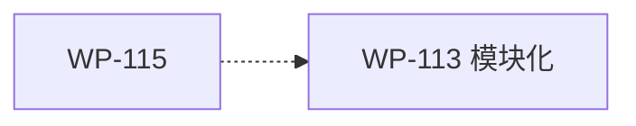

# WP-115: A6 plugin.json schema 形式化

## 🤖 Subagent 读取指令

> **重要**: 此文档包含完整的任务上下文。执行前请阅读以下内容：
> - **目标**: 创建 plugin.json 的 JSON Schema 定义，反向验证 23 个现有插件
> - **实施方案**: JSON Schema 定义 + plugin-validator.js 集成 + 反向验证
> - **关键文件**: plugins/contracts/plugin-schema.json, plugins/runtime/plugin-validator.js
> - **验收标准**: 任务完成的检查清单

## 基本信息

| 属性 | 值 |
|------|-----|
| **优先级** | P0（高） |
| **预估AI时间** | 30min |
| **拆分模式** | simple（不拆分） |
| **状态** | ✅ 完成 |

## 复杂度评估

| 维度 | 评分 | 说明 |
|------|------|------|
| 文件影响范围 | 1 | 新增 1 个文件，修改 1 个文件 |
| 模块数量 | 1 | 仅 plugin-validator |
| 接口变更程度 | 3 | 新增 schema 验证接口 |
| 测试用例预估 | 1 | 新增 ≤5 个测试 |
| 预估AI时间 | 2 | 总计约 30min |
| **总分** | **8** | simple 模式 |

## 依赖关系图

> WP-115 可与 WP-113 并行执行，无硬依赖。WP-113 完成后，plugin-validator.js 会成为独立模块，本 WP 的集成点相应调整。

## 背景

### 数据来源

| 文件 | 角色 | 关键内容 |
|------|------|----------|
| `docs/design/harness-universal-platform-final-design.md` 第 4.3.1 节 | L1 契约验证强化 | JSON Schema 定义和反向验证方案 |

### 问题分析

当前 `tackle validate` 已实现 plugin.json 必填字段检查，但验证规则以硬编码方式存在于 `PLUGIN_REQUIRED_FIELDS` 和 `VALID_PLUGIN_TYPES` 常量中。缺乏声明式 schema 定义导致：

1. 验证规则分散，难以全局理解
2. 外部插件开发者缺少参考规范
3. 字段扩展（如 capabilities）时缺乏统一约束

通过形式化为 JSON Schema，实现：
- 声明式验证规则，可机器读入
- 反向验证 23 个现有插件确保一致性
- 为未来 schema 演进提供基线

## 目标

创建 plugin.json 的 JSON Schema 定义，反向验证 23 个现有插件，集成到 `tackle validate` 命令：

1. **JSON Schema 覆盖所有 plugin.json 字段** — name, version, type, description, metadata, capabilities, dependencies 等
2. **23 个核心插件全部通过验证** — 以代码为准，schema 不强制改插件
3. **零依赖策略** — ajv 作为 optionalDependencies，不可用时回退到内联验证

## 任务清单

### Step 1: 创建 JSON Schema (15min)

- [x] 创建 `plugins/contracts/plugin-schema.json`
- [x] 定义 schema 结构（基于设计文档 4.3.1 节）:
  - `$schema`: `http://json-schema.org/draft-07/schema#`
  - `required`: `["name", "version", "type", "description"]`
  - `properties.name`: `{ "type": "string", "pattern": "^[a-z][a-z0-9-]*$" }`
  - `properties.version`: `{ "type": "string", "pattern": "^\\d+\\.\\d+\\.\\d+" }`
  - `properties.type`: `{ "enum": ["skill", "hook", "validator", "provider"] }`
  - `properties.description`: `{ "type": "string", "minLength": 1 }`
  - `properties.source`: `{ "type": "string" }`
  - `properties.sourceType`: `{ "enum": ["core", "npm", "local"] }`
  - `properties.capabilities`: capabilities 对象结构
  - `properties.config`: `{ "type": "object" }`
  - `properties.metadata`: `{ "type": "object" }`（含 `requiresPlanMode` 等子字段）
  - `properties.dependencies`: array of strings（以代码为准，非设计文档的 object 结构）
  - `properties.triggers`: array of strings（新增，skill 插件使用）
  - `properties.provides`: array of strings（新增，所有插件使用）

### Step 2: 反向验证 23 个插件 (10min)

- [x] 编写临时验证脚本或使用 `tackle validate` 对 23 个 `plugins/core/*/plugin.json` 执行验证
- [x] 记录验证结果
- [x] 如有不一致，以代码为准更新 schema（不强制改插件）
- [x] 确保所有 23 个核心插件通过 schema 验证

### Step 3: 集成到 plugin-validator.js (5min)

- [x] 在 `plugin-validator.js` 中加载 `plugin-schema.json`
- [x] 尝试加载 `ajv`（optionalDependencies），不可用时回退到内联验证
- [x] 新增 `validateWithSchema(pluginJson)` 函数
- [x] 集成到 `validatePlugin()` 流程中（在必填字段检查之后执行）
- [x] `tackle validate` 命令自动使用 schema 验证

## 关键文件

### 输入（读取）
- `plugins/core/*/plugin.json` — 23 个现有插件 manifest（用于反向验证）
- `docs/design/harness-universal-platform-final-design.md` 第 4.3.1 节 — Schema 定义
- `plugins/runtime/plugin-validator.js` — 现有插件验证模块

### 输出（新建）
- `plugins/contracts/plugin-schema.json` — JSON Schema 定义

### 输出（修改）
- `plugins/runtime/plugin-validator.js` — 新增 schema 验证集成

## 验收标准

- [x] JSON Schema 覆盖所有 plugin.json 字段（name, version, type, description, metadata, capabilities, dependencies 等）
- [x] 23 个核心插件全部通过 schema 验证
- [x] ajv 作为 optionalDependencies，不可用时回退到内联验证
- [x] `tackle validate` 命令使用 schema 验证
- [x] 现有 419 测试全部通过（448 含新增 14 测试 + 其他新增测试）
