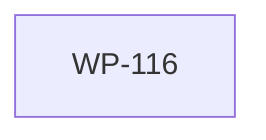

# WP-116: A9 跨平台 CI 矩阵

## 🤖 Subagent 读取指令

> **重要**: 此文档包含完整的任务上下文。执行前请阅读以下内容：
> - **目标**: CI 矩阵添加 windows-latest，确保跨平台兼容
> - **实施方案**: 修改 ci.yml + 修复 Windows 特有路径问题
> - **关键文件**: .github/workflows/ci.yml
> - **验收标准**: 任务完成的检查清单

## 基本信息

| 属性 | 值 |
|------|-----|
| **优先级** | P1（中） |
| **预估AI时间** | 15min |
| **拆分模式** | simple（不拆分） |
| **状态** | ✅ 完成 |

## 复杂度评估

| 维度 | 评分 | 说明 |
|------|------|------|
| 文件影响范围 | 1 | 修改 1 个文件（ci.yml） |
| 模块数量 | 1 | 仅 CI 配置 |
| 接口变更程度 | 1 | 无接口变更 |
| 测试用例预估 | 1 | 无新增测试 |
| 预估AI时间 | 1 | 总计约 15min |
| **总分** | **5** | simple 模式 |

## 依赖关系图



> WP-116 无依赖，可随时执行。

## 背景

### 数据来源

| 文件 | 角色 | 关键内容 |
|------|------|----------|
| `docs/design/harness-universal-platform-final-design.md` 第 5.1 节 | v0.2.0 行动项 A9 | 跨平台 CI 矩阵要求 |
| `.github/workflows/ci.yml` | 当前 CI 配置 | 仅 ubuntu-latest + macos-latest |

### 问题分析

当前 CI 仅在 ubuntu-latest 和 macos-latest 上运行测试（Node.js 18 + 20）。但 Tackle Harness 的用户可能在 Windows 上开发，且本仓库的代码中已存在 Windows 路径处理（`resolve-plugin-path.js` 使用 `path.sep` 等）。缺少 Windows CI 可能导致路径相关 bug 未被发现。

## 目标

CI 矩阵添加 windows-latest，确保 Tackle Harness 在 ubuntu-latest + windows-latest + macos-latest 上全部通过，覆盖 Node.js 18 + 20。

## 任务清单

### Step 1: 修改 ci.yml (10min)

- [ ] 在 `strategy.matrix.os` 中添加 `windows-latest`
- [ ] 检查是否有 Windows 不兼容的步骤（如 shell 脚本、Unix 特有命令）
- [ ] 如有需要，使用条件步骤区分平台:
  ```yaml
  - name: Run tests
    run: node --test test/**/*.js
    # 此命令跨平台兼容，无需区分
  ```
- [ ] 确认 `npm install`、`node bin/tackle.js build`、`node bin/tackle.js validate` 在 Windows 上可执行

### Step 2: 修复 Windows 特有路径问题（如有）(5min)

- [ ] 在 Windows 环境下运行 `node --test test/**/*.js`，观察是否有路径相关失败
- [ ] 常见问题:
  - 路径分隔符: 确保使用 `path.join()` 而非硬编码 `/`
  - 换行符: 确保 `\n` vs `\r\n` 不影响断言
  - 文件权限: Windows 无 `chmod`，确保测试不依赖文件权限
- [ ] 如发现问题，修复相关代码

## 关键文件

### 输入（读取）
- `.github/workflows/ci.yml` — 当前 CI 配置
- `docs/design/harness-universal-platform-final-design.md` 第 5.1 节 — A9 行动项

### 输出（修改）
- `.github/workflows/ci.yml` — 添加 windows-latest 到矩阵

## 验收标准

- [x] CI 在 ubuntu-latest + windows-latest + macos-latest 上全部通过
- [x] Node.js 18 + 20 矩阵覆盖（3 OS x 2 Node = 6 组合）
- [x] 无 Windows 特有的路径问题

## 完成记录

- **完成日期**: 2026-05-30
- **修改文件**: `.github/workflows/ci.yml`
- **变更内容**:
  - `runs-on` 改为 `${{ matrix.os }}`
  - 矩阵添加 `os: [ubuntu-latest, windows-latest, macos-latest]`
  - 添加 `fail-fast: false` 确保一个平台失败不阻塞其他平台
- **Windows 兼容性验证**: 本地 Windows 运行全量测试 346 pass / 0 fail，validate 和 build 命令均正常
