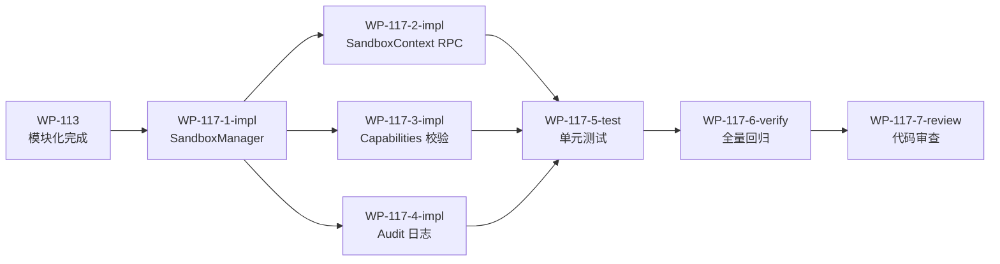

# WP-117: A1-2 Worker Threads 完整沙箱

## 🤖 Subagent 读取指令

> **重要**: 此文档包含完整的任务上下文。执行前请阅读以下内容：
> - **问题分析**: 外部插件在宿主进程中无隔离运行，任意代码执行风险为紧急级别
> - **实施方案**: Worker Threads 沙箱隔离 + Capabilities 运行时校验 + RPC 代理层 + Audit 日志
> - **关键文件**: plugins/runtime/sandbox-manager.js (new), plugins/runtime/sandbox-context.js (new), plugins/contracts/capabilities.js (new)
> - **验收标准**: 任务完成的检查清单

## 基本信息

| 属性 | 值 |
|------|-----|
| **优先级** | P0（阻塞级） |
| **预估AI时间** | 150min |
| **拆分模式** | fine-grained（7 子工作包） |
| **状态** | ✅ 完成 |

## 复杂度评估

| 维度 | 评分 | 说明 |
|------|------|------|
| 文件影响范围 | 3 | 新增 >5 个文件 |
| 模块数量 | 3 | 涉及 >3 个模块 |
| 接口变更程度 | 3 | 新增接口 |
| 测试用例预估 | 3 | 新增 >15 个测试 |
| 预估AI时间 | 3 | 总计约 150min |
| **总分** | **15** | fine-grained 模式 |

## 子工作包列表

| ID | 类型 | 职责 | 依赖 | 执行角色 | 状态 |
|----|------|------|------|----------|------|
| WP-117-1-impl | 实现 | SandboxManager + Worker Thread 生命周期 | WP-113 | implementer | ✅ |
| WP-117-2-impl | 实现 | SandboxContext RPC 代理层 | WP-117-1 | implementer | ✅ |
| WP-117-3-impl | 实现 | Capabilities 运行时校验 + 能力限制矩阵 | WP-117-1 | implementer | ✅ |
| WP-117-4-impl | 实现 | Audit 日志持久化 (JSONL) | WP-117-1 | implementer | ✅ |
| WP-117-5-test | 测试 | 沙箱系统单元测试 | WP-117-2~4 | tester | ✅ |
| WP-117-6-verify | 验证 | 测试验证 + 全量回归 | WP-117-5 | tester | ✅ |
| WP-117-7-review | 审查 | 代码审查 | WP-117-6 | reviewer | ✅ |

## 依赖关系图



## 背景

### 数据来源

| 文件 | 角色 | 关键内容 |
|------|------|----------|
| `docs/design/harness-universal-platform-final-design.md` 第 3 章 | 安全模型设计 | 威胁模型、Capabilities 声明系统、Worker Threads 沙箱架构、权限分级策略、审计日志设计 |
| `docs/design/harness-universal-platform-final-design.md` 第 3.2 节 | Capabilities 声明系统 | plugin.json 扩展、Capabilities 枚举定义、能力校验流程 |
| `docs/design/harness-universal-platform-final-design.md` 第 3.3 节 | Worker Threads 沙箱 | SandboxManager、SandboxContext、与 PluginContext DI 的集成 |
| `docs/design/harness-universal-platform-final-design.md` 第 3.4 节 | 权限分级策略 | core/npm/local 三级信任模型、能力限制矩阵 |
| `docs/design/harness-universal-platform-final-design.md` 第 3.5 节 | 审计日志设计 | JSONL 格式、事件类型、日志存储策略 |

### 问题分析

当前 Tackle Harness 的安全成熟度仅 1/5（WP-109/WP-110 共识）。核心攻击路径：

```
用户执行 `tackle install tackle-plugin-malicious`
  → commands/install.js 执行 npm install
  → plugin-registry.json 新增条目 { sourceType: "npm", source: "tackle-plugin-malicious" }
  → 用户执行 `tackle build`
  → harness-build.js 调用 resolve-plugin-path.js 解析路径
  → plugin-loader.js:462 执行 require(resolvedPath + "/index.js")
  → 恶意插件的 index.js 获得宿主进程完全控制权
```

WP-110 对比了三种沙箱方案（Worker Threads / VM Module / 子进程），排除了 VM Module（已知逃逸）和子进程（过度工程），推荐 Worker Threads。

v0.2.0 已实现安全最小集（WP-112: 安装时确认 + 构建时警告），本 WP 在 v0.3.0 中实现完整的 Worker Threads 沙箱隔离。

## 目标

实现 Worker Threads 沙箱隔离 + Capabilities 运行时校验 + RPC 代理层 + Audit 日志，包含四个核心组件：

1. **SandboxManager** — Worker Thread 生命周期管理（创建、激活、运行、终止）
2. **SandboxContext** — RPC 代理层（postMessage 通信，代理 eventBus/stateStore/logger/getProvider）
3. **Capabilities** — 运行时能力校验 + core/npm/local 三级信任限制矩阵
4. **Audit Logger** — JSONL 格式审计日志持久化

## 关键文件

### 输入（读取）
- `docs/design/harness-universal-platform-final-design.md` 第 3 章 — 安全模型设计
- `plugins/runtime/plugin-loader.js` — 插件加载流程（需集成沙箱）
- `plugins/contracts/plugin-interface.js` — Plugin 基类和 PluginContext（需理解 DI 机制）
- `plugins/runtime/state-store.js` — 被代理的服务之一
- `plugins/runtime/event-bus.js` — 被代理的服务之一
- `plugins/runtime/logger.js` — 被代理的服务之一

### 输出（新建）
- `plugins/runtime/sandbox-manager.js` — SandboxManager 类（Worker Thread 生命周期）
- `plugins/runtime/sandbox-context.js` — SandboxContext 类（RPC 代理层）
- `plugins/contracts/capabilities.js` — Capability 枚举 + CAPABILITY_LEVELS 映射
- `plugins/runtime/audit-logger.js` — 审计日志持久化（JSONL 格式）
- `test/runtime/test-sandbox-manager.js` — SandboxManager 测试
- `test/runtime/test-sandbox-context.js` — SandboxContext 测试
- `test/runtime/test-capabilities.js` — Capabilities 测试
- `test/runtime/test-audit-logger.js` — AuditLogger 测试

## 验收标准

- [x] 外部插件在 Worker Thread 中隔离运行
- [x] RPC 代理层支持 eventBus/stateStore/logger 通信
- [x] Capabilities 声明与运行时校验一致
- [x] core/npm/local 三级信任模型生效
- [x] child_process 对 npm/local 插件禁止
- [x] Audit 日志写入 JSONL 文件
- [x] 全量测试通过
