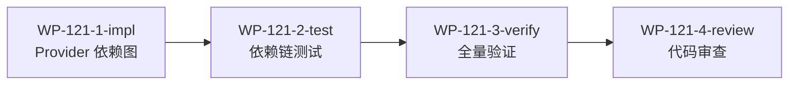

# WP-121: A8 Provider 依赖链补全

## 🤖 Subagent 读取指令

> **重要**: 此文档包含完整的任务上下文。执行前请阅读以下内容：
> - **问题分析**: plugin-loader.js _buildDependencyGraph 仅处理 plugins 依赖，不处理 providers 依赖
> - **实施方案**: 扩展 _buildDependencyGraph 正确处理 providers 依赖和循环检测
> - **关键文件**: plugins/runtime/plugin-loader.js
> - **验收标准**: 任务完成的检查清单

## 基本信息

| 属性 | 值 |
|------|-----|
| **优先级** | P1（高） |
| **预估AI时间** | 45min |
| **拆分模式** | standard（4 子工作包） |
| **状态** | ✅ 完成 |

## 复杂度评估

| 维度 | 评分 | 说明 |
|------|------|------|
| 文件影响范围 | 2 | 修改 3-5 个文件 |
| 模块数量 | 2 | 涉及 2-3 个模块 |
| 接口变更程度 | 2 | 接口修改（扩展依赖图构建） |
| 测试用例预估 | 2 | 新增 6-15 个测试 |
| 预估AI时间 | 2 | 总计约 45min |
| **总分** | **10** | standard 模式 |

## 子工作包列表

| ID | 类型 | 职责 | 依赖 | 执行角色 | 状态 |
|----|------|------|------|----------|------|
| WP-121-1-impl | 实现 | Provider 依赖图构建 + 循环检测 | - | implementer | 📋 |
| WP-121-2-test | 测试 | Provider 依赖链测试 | WP-121-1 | tester | 📋 |
| WP-121-3-verify | 验证 | 全量测试回归 | WP-121-2 | tester | 📋 |
| WP-121-4-review | 审查 | 代码审查 | WP-121-3 | reviewer | 📋 |

## 依赖关系图

> WP-121 无硬性前置依赖，但建议在 Phase 2 执行。

## 背景

### 数据来源

| 文件 | 角色 | 关键内容 |
|------|------|----------|
| `docs/design/harness-universal-platform-final-design.md` 第 5.1 节 A8 | Provider 依赖链补全行动项 | _buildDependencyGraph 处理 providers 依赖 |
| `docs/design/harness-universal-platform-final-design.md` 分歧 2 | 关键障碍识别 | Provider 依赖链断裂 |
| `plugins/runtime/plugin-loader.js` | 当前代码 | _buildDependencyGraph 实现（行 350-367） |

### 问题分析

`plugin-loader.js:350-367` 的 `_buildDependencyGraph` 仅处理 `plugins` 依赖（`plugin.json` 的 `dependencies.plugins` 字段），不处理 `providers` 依赖（`dependencies.providers` 字段）。这导致：

1. 第三方 Provider 插件无法正确加载
2. Provider 加载顺序不受依赖关系约束
3. 当 Plugin B 依赖 Provider A 时，B 可能在 A 之前加载，导致 `getProvider()` 返回 undefined
4. 循环依赖检测对 Provider 链无效

这是第三方 Provider 插件加载的直接阻塞项（WP-110 维度 3 发现）。

## 目标

扩展 `plugin-loader.js` 的 `_buildDependencyGraph` 正确处理 providers 依赖：

1. **Provider 依赖解析** — `_buildDependencyGraph` 处理 `dependencies.providers` 字段
2. **加载顺序保证** — 被依赖的 Provider 优先加载
3. **循环依赖检测** — Provider 依赖链的循环检测
4. **第三方 Provider 支持** — 第三方 Provider 插件可正常加载

## 关键文件

### 输入（读取）
- `docs/design/harness-universal-platform-final-design.md` 第 5.1 节 A8 — Provider 依赖链补全行动项
- `plugins/runtime/plugin-loader.js` — 当前 _buildDependencyGraph 实现
- `plugins/contracts/plugin-interface.js` — Plugin 基类和 Provider 接口

### 输出（修改）
- `plugins/runtime/plugin-loader.js` — 扩展 _buildDependencyGraph 处理 providers 依赖

## 验收标准

- [x] _buildDependencyGraph 正确处理 provider 依赖
- [x] 第三方 Provider 插件可正常加载
- [x] 循环依赖检测有效
- [x] Provider 加载顺序正确（被依赖者优先）

**完成日期**: 2026-05-30
