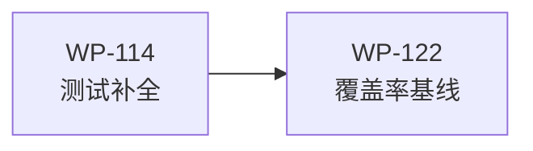

# WP-122: A10 覆盖率基线 + CI 门槛

## 🤖 Subagent 读取指令

> **重要**: 此文档包含完整的任务上下文。执行前请阅读以下内容：
> - **问题分析**: CI 无覆盖率门槛，质量退化风险高，覆盖率报告未集成到 CI 流程
> - **实施方案**: 配置 Node.js 内置覆盖率工具，设置 70% 行覆盖率门槛
> - **关键文件**: package.json, .github/workflows/ci.yml
> - **验收标准**: 任务完成的检查清单

## 基本信息

| 属性 | 值 |
|------|-----|
| **优先级** | P1（中） |
| **预估AI时间** | 15min |
| **拆分模式** | simple（不拆分） |
| **状态** | ✅ 完成 |

## 复杂度评估

| 维度 | 评分 | 说明 |
|------|------|------|
| 文件影响范围 | 1 | 修改 ≤2 个文件 |
| 模块数量 | 1 | 仅涉及 1 个模块（CI 配置） |
| 接口变更程度 | 1 | 无接口变更 |
| 测试用例预估 | 1 | 新增 ≤5 个测试 |
| 预估AI时间 | 1 | 总计约 15min |
| **总分** | **5** | simple 模式 |

## 依赖关系图

> WP-122 依赖 WP-114（测试补全后设置覆盖率门槛才有意义）。

## 背景

### 数据来源

| 文件 | 角色 | 关键内容 |
|------|------|----------|
| `docs/design/harness-universal-platform-final-design.md` 第 4.3.5 节 | L5 质量关卡配置 | CI 覆盖率门槛的具体配置方案 |
| `docs/design/harness-universal-platform-final-design.md` 第 5.1 节 A10 | 覆盖率基线行动项 | 配置 Node.js 内置覆盖率、设 70% 门槛 |
| `.github/workflows/ci.yml` | 当前 CI 配置 | 需要增强覆盖率报告和门槛检查 |

### 问题分析

当前 CI 流程中：
1. 无覆盖率门槛 — 覆盖率下降不会导致 CI 失败
2. 无覆盖率报告 — 覆盖率数据未持久化，无法在 PR 中查看趋势
3. 覆盖率基线未建立 — 无法追踪覆盖率变化

WP-110 报告显示整体行覆盖率 70.48%，但 3 个模块覆盖率低于 50%。WP-114（测试补全）完成后，覆盖率将显著提升，此时设置 70% 门槛可防止后续退化。

## 目标

配置 Node.js 内置覆盖率工具，设置 70% 行覆盖率门槛：

1. **覆盖率配置** — `node --test --experimental-test-coverage` 集成到 CI
2. **门槛设置** — 行覆盖率低于 70% 时 CI 失败
3. **报告持久化** — 覆盖率报告可在 CI artifacts 中查看

## 关键文件

### 输入（读取）
- `docs/design/harness-universal-platform-final-design.md` 第 4.3.5 节 — L5 质量关卡配置
- `.github/workflows/ci.yml` — 当前 CI 配置
- `package.json` — npm scripts 配置

### 输出（修改）
- `.github/workflows/ci.yml` — 新增覆盖率报告步骤和门槛检查
- `package.json` — 新增覆盖率相关 npm scripts（可选）

## 验收标准

- [ ] node --test --experimental-coverage 配置完成
- [ ] CI 中覆盖率低于 70% 时失败
- [ ] 覆盖率报告可在 CI artifacts 中查看
