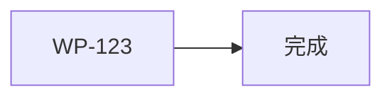

# WP-123: A11 工程卫生

## 🤖 Subagent 读取指令

> **重要**: 此文档包含完整的任务上下文。执行前请阅读以下内容：
> - **目标**: lock 文件同步、CONTRIBUTING.md 更新、测试计数统一
> - **实施方案**: 逐项检查并修正工程卫生问题
> - **关键文件**: package-lock.json, CONTRIBUTING.md, README.md
> - **验收标准**: 任务完成的检查清单

## 基本信息

| 属性 | 值 |
|------|-----|
| **优先级** | P2（中） |
| **预估AI时间** | 30min |
| **拆分模式** | simple（不拆分） |
| **状态** | ✅ 完成 |

## 复杂度评估

| 维度 | 评分 | 说明 |
|------|------|------|
| 文件影响范围 | 2 | 修改 3-5 个文件 |
| 模块数量 | 1 | 工程配置文件维护 |
| 接口变更程度 | 1 | 无接口变更 |
| 测试用例预估 | 1 | 新增 ≤5 个验证 |
| 预估AI时间 | 2 | 总计约 30min |
| **总分** | **7** | simple 模式 |

## 依赖关系图

> WP-123 不依赖任何其他 WP，可独立执行。

## 背景

### 问题分析

- `package-lock.json` 可能与 `package.json` 不同步，导致 `npm ci` 在 CI 环境失败
- 项目缺少 `CONTRIBUTING.md` 贡献指南，贡献者无法了解贡献流程和代码规范
- `README.md` 中引用的测试计数可能与实际测试数量不一致

## 目标

确保项目工程卫生达到开源协作标准：

1. **package-lock.json 同步验证** — 确保 lock 文件与 package.json 完全一致
2. **CONTRIBUTING.md 创建** — 提供完整的贡献指南
3. **测试计数统一** — README 中的测试数量与实际一致

## 任务清单

### Step 1: package-lock.json 同步验证 (~10min)

- [x] 运行 `npm ci` 验证 lock 文件一致性
- [x] 若不一致，运行 `npm install` 重新生成 lock 文件
- [x] 验证 `npm ci` 可成功执行
- [x] 检查 lock 文件中无多余或缺失的依赖

### Step 2: CONTRIBUTING.md 创建 (~15min)

- [x] 编写贡献流程说明（Fork → Branch → PR → Review）
- [x] 编写代码规范（引用 CLAUDE.md 中的代码约定）
- [x] 编写 PR 模板说明
- [x] 编写 commit 规范说明（Conventional Commits）
- [x] 编写测试要求（运行命令、覆盖率期望）

### Step 3: 测试计数统一 (~5min)

- [x] 运行 `node --test test/**/*.js` 获取实际测试数量
- [ ] 更新 README.md 中的测试计数
- [ ] 确认计数准确

## 关键文件

### 输入（读取）
- `package.json` — 当前依赖声明
- `package-lock.json` — 当前 lock 文件
- `README.md` — 现有 README
- `CLAUDE.md` — 代码规范参考

### 输出（修改）
- `package-lock.json` — 如需要，重新生成
- `CONTRIBUTING.md` — 新建
- `README.md` — 更新测试计数

## 验收标准

- [x] `npm ci` 成功执行，无错误
- [x] `CONTRIBUTING.md` 包含完整的贡献指南（流程、规范、模板）
- [x] README 中的测试计数与实际一致
- [x] 无遗留的工程卫生问题
