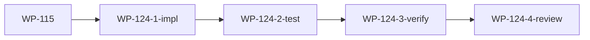

# WP-124: A12 版本迁移路径

## 🤖 Subagent 读取指令

> **重要**: 此文档包含完整的任务上下文。执行前请阅读以下内容：
> - **目标**: tackle migrate 升级路径测试 + 回滚策略文档
> - **实施方案**: 测试 v0.1.x → v0.2.0 升级、编写回滚策略、验证 schema 向后兼容
> - **关键文件**: commands/migrate.js, docs/migration-guide.md
> - **验收标准**: 任务完成的检查清单

## 基本信息

| 属性 | 值 |
|------|-----|
| **优先级** | P2（中） |
| **预估AI时间** | 30min |
| **拆分模式** | standard |
| **状态** | ✅ 完成 |

## 复杂度评估

| 维度 | 评分 | 说明 |
|------|------|------|
| 文件影响范围 | 2 | 修改 3-5 个文件 |
| 模块数量 | 2 | migrate 命令 + 文档 |
| 接口变更程度 | 2 | 接口修改 |
| 测试用例预估 | 1 | 新增 ≤5 个测试 |
| 预估AI时间 | 2 | 总计约 30min |
| **总分** | **9** | standard 模式 |

## 子工作包列表

| ID | 类型 | 职责 | 依赖 | 执行角色 | 状态 |
|----|------|------|------|----------|------|
| WP-124-1-impl | 实现 | v0.1.x → v0.2.0 升级路径测试 | - | implementer | ✅ |
| WP-124-2-test | 测试 | migrate 命令边界测试 | WP-124-1-impl | tester | ✅ |
| WP-124-3-verify | 验证 | schema 向后兼容验证 | WP-124-2-test | tester | ✅ |
| WP-124-4-review | 审查 | 迁移路径审查 | WP-124-3-verify | reviewer | ✅ |

## 依赖关系图

> WP-124 依赖 WP-115（schema 形式化后才能验证迁移）。

## 背景

### 数据来源

| 文件 | 角色 | 关键内容 |
|------|------|----------|
| `docs/design/harness-universal-platform-final-design.md` 第 5 节 | 实施路线图 | v0.2.0 迁移策略 |
| `commands/migrate.js` | 现有迁移命令 | 当前迁移实现 |
| `plugins/plugin-registry.json` | 插件注册表 | plugin.json schema 定义 |

### 问题分析

- `tackle migrate` 命令存在但缺乏从 v0.1.x 到 v0.2.0 的完整升级路径测试
- 用户从旧版本升级时可能遇到 schema 不兼容问题
- 缺少回滚策略文档，用户升级失败时无法回退
- plugin.json schema 的向后兼容性未经系统性验证

## 目标

确保 tackle migrate 升级路径可靠且可回滚：

1. **升级路径测试** — 测试从 v0.1.x 到 v0.2.0 的完整升级流程
2. **回滚策略文档** — 编写版本回滚指南
3. **Schema 向后兼容** — 验证 plugin.json schema 的向后兼容性

## 实施计划

### Step 1: 升级路径测试

- [x] 准备 v0.1.x 格式的测试 fixture（plugin.json, harness-config.yaml）
- [x] 执行 tackle migrate 升级
- [x] 验证升级后的文件格式正确
- [x] 验证升级后 build/validate 可正常运行

### Step 2: 回滚策略文档

- [x] 编写回滚操作步骤
- [x] 列出升级前的备份建议
- [x] 说明回滚的边界和限制

### Step 3: Schema 兼容性验证

- [x] 检查 v0.1.x plugin.json 在 v0.2.0 下是否可正常解析
- [x] 检查新增字段是否有合理默认值
- [x] 验证 migrate 命令处理所有边界情况

## 关键文件

### 输入（读取）
- `commands/migrate.js` — 现有迁移命令实现
- `plugins/plugin-registry.json` — plugin.json schema
- `docs/design/harness-universal-platform-final-design.md` — 设计方案

### 输出（修改/新建）
- `test/runtime/test-migrate.js` — 新建迁移测试
- `docs/migration-guide.md` — 新建迁移指南

## 验收标准

- [x] v0.1.x → v0.2.0 升级路径测试通过
- [x] 回滚策略文档完整（操作步骤 + 备份建议 + 限制说明）
- [x] plugin.json schema 向后兼容（v0.1.x 格式可在 v0.2.0 下解析）
- [x] migrate 命令处理所有边界情况（缺失字段、未知字段、格式错误）
