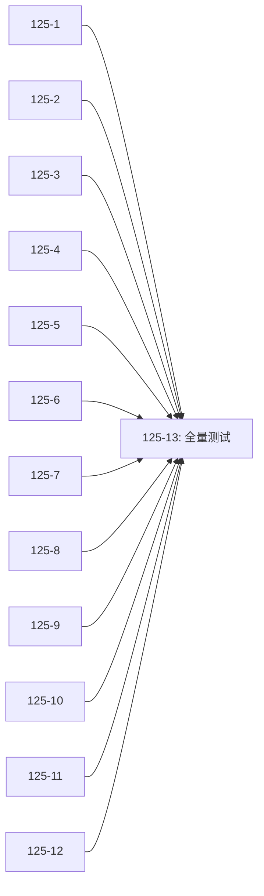

# WP-125: v0.2.0 成果校验与全量测试

## 🤖 Subagent 读取指令

> **重要**: 此文档包含完整的任务上下文。执行前请阅读以下内容：
> - **问题分析**: v0.2.0 路线图 12 个已完成 WP 需要系统性校验，两批次执行可能存在交叉回归问题
> - **实施计划**: 按 12 个独立校验子包并行执行，最终全量测试
> - **关键文件**: 30+ 文件跨安全/架构/插件/测试/工程 5 个功能域
> - **验收标准**: 每个 WP 的成果验证通过 + 全量测试 0 失败

## 基本信息

| 属性 | 值 |
|------|-----|
| **优先级** | P0 |
| **预估AI时间** | 190min |
| **拆分模式** | fine-grained |
| **状态** | ✅ 完成 (2026-05-30) |

## 复杂度评估

| 维度 | 评分 | 说明 |
|------|------|------|
| 文件影响范围 | 3 | 涉及 30+ 文件 |
| 模块数量 | 3 | 12 个 WP 跨 5 个功能域 |
| 接口变更程度 | 1 | 纯校验 + 修复，不设计新接口 |
| 测试用例数 | 3 | 586 个现有测试 |
| 预估AI时间 | 3 | >30min |
| **总分** | **13** | 模式: fine-grained |

## 子工作包列表

| ID | 类型 | 职责 | 依赖 | 执行角色 | 状态 |
|----|------|------|------|----------|------|
| WP-125-1-verify | 校验 | WP-112 安全最小集 | - | tester | ✅ |
| WP-125-2-verify | 校验 | WP-113 模块化 | - | tester | ✅ |
| WP-125-3-verify | 校验 | WP-114 测试补全 | - | tester | ✅ |
| WP-125-4-verify | 校验 | WP-115 Schema 形式化 | - | tester | ✅ |
| WP-125-5-verify | 校验 | WP-116 跨平台 CI | - | tester | ✅ |
| WP-125-6-verify | 校验 | WP-117 Worker Threads 沙箱 | - | tester | ✅ |
| WP-125-7-verify | 校验 | WP-118 E2E 测试 | - | tester | ✅ |
| WP-125-8-verify | 校验 | WP-120 Manifest 扩展 | - | tester | ✅ |
| WP-125-9-verify | 校验 | WP-121 Provider 依赖链 | - | tester | ✅ |
| WP-125-10-verify | 校验 | WP-122 覆盖率基线 | - | tester | ✅ |
| WP-125-11-verify | 校验 | WP-123 工程卫生 | - | tester | ✅ |
| WP-125-12-verify | 校验 | WP-124 版本迁移 | - | tester | ✅ |
| WP-125-13-verify | 校验 | 全量测试 | WP-125-1~12 | tester | ✅ |

## 依赖关系图

## 目标

系统性校验 v0.2.0 路线图中 12 个已完成 WP（WP-112~124，排除 WP-119）的成果，修复发现的任何问题，确保交叉回归问题被捕获，最终通过全量测试验证整体质量。

## 问题分析

### 背景

v0.2.0 路线图分两个批次执行：
- **批次 1**: WP-112/113/115/117/118/124（6 WP 并行，最大 2 并发）
- **批次 2**: WP-114/116/120/121/122/123（6 WP 并行，最大 3 并发）

两批次在不同时间点执行，可能存在交叉回归问题（批次 1 的代码修改影响批次 2 的测试，反之亦然）。需要系统性校验确保所有 12 个 WP 的成果在合并后仍然正确。

### 校验范围

| WP | Action | 核心产出 |
|----|--------|----------|
| WP-112 | A1-1 安全最小集 | confirmInstall(), validateCapabilities() |
| WP-113 | A2 模块化 | 4 个新模块 + harness-build.js 重构 |
| WP-114 | A3 测试补全 | 3 模块 77 个新增测试 |
| WP-115 | A6 Schema | plugin-schema.json + schema 验证集成 |
| WP-116 | A9 CI 矩阵 | 3 OS × 2 Node CI 矩阵 |
| WP-117 | A1-2 沙箱 | Worker Threads 完整沙箱 5 个新文件 |
| WP-118 | A4 E2E | CLI 子进程级 E2E 测试 |
| WP-120 | A7 Manifest | resolveEffectivePlugins + 3 API |
| WP-121 | A8 Provider | _buildDependencyGraph + _buildProviderMap |
| WP-122 | A10 覆盖率 | test:coverage 脚本 + CI 门槛 |
| WP-123 | A11 工程卫生 | CONTRIBUTING.md + npm ci |
| WP-124 | A12 迁移 | migrate 命令测试 + 回滚策略 |

## 验收标准

- [x] 12 个独立校验子包全部通过
- [x] 发现的问题全部修复或已与用户讨论决策
- [x] 全量测试 `node --test test/**/*.js` 0 失败
- [x] 覆盖率 ≥ 70%
- [x] `node bin/tackle.js build && validate` 通过
- [x] smoke test 通过

## 完成记录

- **完成日期**: 2026-05-30
- **执行方式**: 13 子包并行调度，最大 4 并发，Agent Teams 机制
- **发现并修复 3 个问题**:
  1. `package.json` 添加 ajv optionalDependencies
  2. `package-lock.json` 重新生成同步 5 个缺失依赖
  3. `test-wp112-security.js:390` filesystem capability 类型修正
- **最终指标**: 586/586 测试通过，覆盖率 74.99%，build+validate 通过，smoke test 6/6
- **执行报告**: `docs/reports/2026-05-30_WP-125_execution_report.md`
