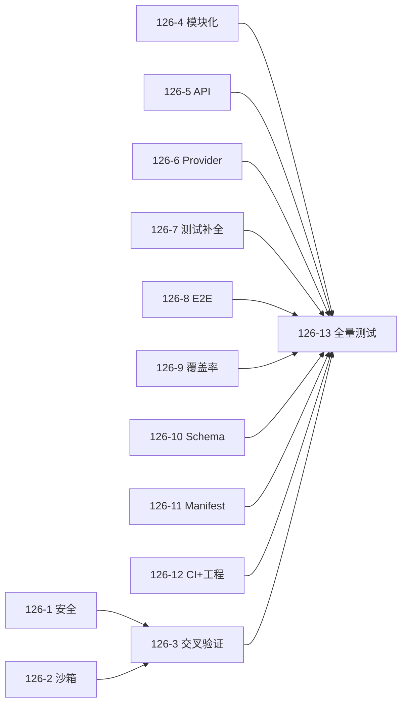

# WP-126: v0.2.0 二次校验与全量测试

## 🤖 Subagent 读取指令

> **重要**: 此文档包含完整的任务上下文。执行前请阅读以下内容：
> - **问题分析**: v0.2.0 路线图 13 个 WP 已全部完成 + WP-125 首次校验通过，需二次校验确认合并后成果正确、修复新发现的问题、处理 4 项待决策问题
> - **实施计划**: 按 5 功能域分组并行校验，新增跨 WP 交叉验证，最终全量测试
> - **关键文件**: 30+ 文件跨安全/架构/插件/测试/工程 5 个功能域
> - **验收标准**: 12 个校验子包全部通过 + 全量测试 0 失败 + 4 项 DECISION 已决策

## 基本信息

| 属性 | 值 |
|------|-----|
| **优先级** | P0 |
| **预估AI时间** | 185min |
| **拆分模式** | fine-grained |
| **依赖** | WP-125 完成 |
| **状态** | ✅ 完成 |

## 复杂度评估

| 维度 | 评分 | 说明 |
|------|------|------|
| 文件影响范围 | 3 | 涉及 30+ 文件 |
| 模块数量 | 3 | 13 个 WP 跨 5 功能域 |
| 接口变更程度 | 1 | 纯校验+修复，不设计新接口 |
| 测试用例数 | 3 | 586 个现有测试 |
| 预估AI时间 | 3 | >30min |
| **总分** | **13** | 模式: fine-grained |

## 子工作包列表

| ID | 类型 | 职责 | 依赖 | 执行角色 | 预估 | 状态 |
|----|------|------|------|----------|------|------|
| WP-126-1-verify | 安全域 | WP-112 安全最小集校验 | - | tester | 15min | ✅ |
| WP-126-2-verify | 安全域 | WP-117 Worker Threads 沙箱校验 | - | tester | 25min | ✅ |
| WP-126-3-verify | 交叉域 | WP-112 × WP-117 集成交叉验证 | 126-1, 126-2 | tester | 15min | ✅ |
| WP-126-4-verify | 架构域 | WP-113 模块化校验 | - | tester | 20min | ✅ |
| WP-126-5-verify | 架构域 | WP-119 API 稳定性分类校验 | - | tester | 15min | ✅ |
| WP-126-6-verify | 架构域 | WP-121 Provider 依赖链校验 | - | tester | 15min | ✅ |
| WP-126-7-verify | 质量域 | WP-114 测试补全校验 | - | tester | 15min | ✅ |
| WP-126-8-verify | 质量域 | WP-118 E2E 测试校验 | - | tester | 15min | ✅ |
| WP-126-9-verify | 质量域 | WP-122 覆盖率基线校验 | - | tester | 10min | ✅ |
| WP-126-10-verify | 插件域 | WP-115 Schema 形式化校验 | - | tester | 15min | ✅ |
| WP-126-11-verify | 插件域 | WP-120 Manifest 扩展校验 | - | tester | 15min | ✅ |
| WP-126-12-verify | 工程域 | WP-116/123/124 CI+工程+迁移校验 | - | tester | 20min | ✅ |
| WP-126-13-verify | 全量测试 | 全量测试与最终报告 | 126-1~12 | tester | 15min | ✅ |

## 依赖关系图

## 并行调度策略

- **第一批**（最大并行）: 126-1, 2, 4, 5, 6, 7, 8, 9, 10, 11, 12（11 个子包）
- **第二批**: 126-3（仅依赖 126-1 和 126-2 完成后即可开始）
- **第三批**: 126-13（依赖全部完成）

最大并发 4-6，墙钟时间约 60-70min。

## 目标

系统性二次校验 v0.2.0 路线图中 13 个已完成 WP 的成果，重点聚焦于：
1. WP-125 首次修复项的回归确认（ajv 依赖、lock 文件同步、schema 类型）
2. 跨 WP 交叉验证（安全 × 沙箱集成）
3. 覆盖率薄弱点深度检查（sandbox-manager 64.50%）
4. WP-119 API 稳定性分类（WP-125 未覆盖）
5. 发现问题后修复，需决策的问题与用户讨论

## 问题分析

### 背景

v0.2.0 路线图分两个批次执行：
- **批次 1**: WP-112/113/115/117/118/124（6 WP 并行）
- **批次 2**: WP-114/116/120/121/122/123（6 WP 并行）
- **首次校验**: WP-125（13 子包，发现并修复 3 个问题）

二次校验与首次校验的差异：
1. 增加了跨 WP 交叉验证（WP-112 × WP-117 安全链路集成）
2. 聚焦首次修复项的回归确认
3. 深度检查覆盖率薄弱点
4. 明确覆盖 WP-119（API 稳定性分类）
5. 标识了 4 个待决策问题

### 校验范围

| WP | 域 | 核心产出 |
|----|-----|----------|
| WP-112 | 安全 | confirmInstall(), validateCapabilities(), TACKLE_ASSUME_YES |
| WP-113 | 架构 | 4 个新模块 + harness-build.js 重构 (1571→1026行) |
| WP-114 | 质量 | validator-pipeline 40 测试 + hook-dispatcher 37 测试 |
| WP-115 | 插件 | plugin-schema.json + schema 验证集成 |
| WP-116 | 工程 | 3 OS × 2 Node CI 矩阵 |
| WP-117 | 安全 | Worker Threads 完整沙箱 5 个新文件 |
| WP-118 | 质量 | 18 个 CLI 子进程级 E2E 测试 |
| WP-119 | 架构 | ~211 个 API @public/@internal/@experimental 标注 |
| WP-120 | 插件 | resolveEffectivePlugins + 3 API |
| WP-121 | 架构 | _buildDependencyGraph + _buildProviderMap |
| WP-122 | 质量 | test:coverage 脚本 + CI 70% 门槛 |
| WP-123 | 工程 | CONTRIBUTING.md 修正 |
| WP-124 | 工程 | migrate 命令 + 迁移测试 |

## 待决策问题（4 项）

| 编号 | 来源 | 问题 | 建议 | 影响范围 |
|------|------|------|------|----------|
| DECISION-1 | WP-126-2 | sandbox-manager.js 覆盖率 64.50%，约 200 行未覆盖，是否补测试？ | 标记技术债务推到 v0.3.0 | 安全域 |
| DECISION-2 | WP-126-4 | commands/init.js:62 require 路径疑似错误，是否修复？ | 确认是否被触达，如触达则修复 | 架构域 |
| DECISION-3 | WP-126-5 | CAPABILITY_RESTRICTIONS @internal 仍导出，是否处理？ | 接受为已知文档约定 | API 域 |
| DECISION-4 | WP-126-9 | 是否增加单模块覆盖率 CI 门槛？ | 维持全局 70% 门槛即可 | 质量域 |

## 验收标准

- [x] 12 个独立校验子包全部通过
- [x] 4 个 DECISION 项已与用户讨论并决策
- [x] 发现的问题全部修复（遗留问题移交 WP-127）
- [x] 全量测试 `node --test test/**/*.js` 0 失败
- [x] 覆盖率 ≥ 70%（75.61%）
- [x] `node bin/tackle.js build && validate` 通过
- [x] smoke test 6/6 通过
