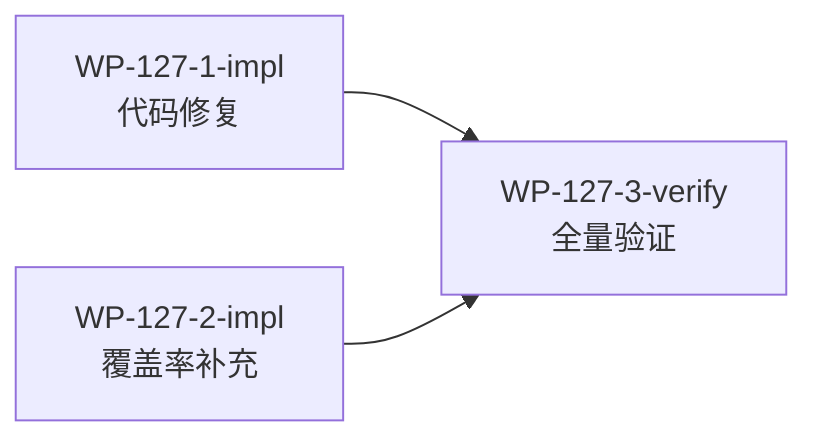

# WP-127: WP-126 决策跟进与修复

## 🤖 Subagent 读取指令

> **重要**: 此文档包含完整的任务上下文。执行前请阅读以下内容：
> - **问题分析**: WP-126 二次校验产生 4 项 DECISION 和 1 个 LOW 问题，用户已做出决策
> - **实施计划**: 按 3 个子工作包执行（127-1 代码修复 + 127-2 覆盖率补充 → 127-3 全量验证）
> - **关键文件**: 5 个文件跨 commands/runtime/contracts/tests
> - **验收标准**: 全量测试 0 失败 + sandbox-manager 覆盖率 ≥75% + build+validate 通过

## 基本信息

| 属性 | 值 |
|------|-----|
| **优先级** | P1 |
| **预估AI时间** | 30min |
| **拆分模式** | standard |
| **依赖** | WP-126 完成 |
| **状态** | ✅ 完成 |

## 复杂度评估

| 维度 | 评分 | 说明 |
|------|------|------|
| 文件影响范围 | 2 | 5 个文件 |
| 模块数量 | 2 | commands + runtime/contracts + tests |
| 接口变更程度 | 1 | 无新接口，修复+测试 |
| 测试用例数 | 2 | ~15 个新测试 |
| 预估AI时间 | 2 | ~25min |
| **总分** | **9** | 模式: standard |

## 子工作包列表

| ID | 类型 | 职责 | 依赖 | 执行角色 | 预估 | 状态 |
|----|------|------|------|----------|------|------|
| WP-127-1-impl | 修复 | init.js 路径 + plugin_access 统一 + DECISION 文档 | - | implementer | 10min | ✅ |
| WP-127-2-impl | 测试 | sandbox-manager.js 覆盖率补充 | - | tester | 15min | ✅ |
| WP-127-3-verify | 验证 | 全量测试 + 覆盖率确认 | 127-1, 127-2 | tester | 5min | ✅ |

## 依赖关系图

## 用户决策汇总

| 决策 | 问题 | 用户选择 | 行动 |
|------|------|----------|------|
| DECISION-1 | sandbox-manager 覆盖率 64.50% | v0.2.0 内补充测试 | WP-127-2 |
| DECISION-2 | init.js:62 require 路径错误 | 立即修复 | WP-127-1 |
| DECISION-3 | CAPABILITY_RESTRICTIONS @internal 导出 | 接受为已知约定 | 文档记录 |
| DECISION-4 | 单模块 CI 门槛 | 维持全局 70% | 文档记录 |
| ISSUE-126-3-1 | plugin_access 键名不一致 | 修复 | WP-127-1 |

## 并行调度策略

- **第一批（并行）**: 127-1 + 127-2
- **第二批**: 127-3

最大并发 2，墙钟时间约 15min。

## 验收标准

- [x] commands/init.js:62 require 路径已修正
- [x] plugin_access 已加入 KNOWN_CAPABILITIES 和 plugin-schema.json
- [x] sandbox-manager.js 覆盖率 ≥75%（当前 64.50%）
- [x] 全量测试 `node --test test/**/*.js` 0 失败
- [x] 覆盖率 ≥70%
- [x] `node bin/tackle.js build && validate` 通过
- [x] smoke test 6/6 通过
- [x] DECISION-3/4 已在报告中记录用户决策
