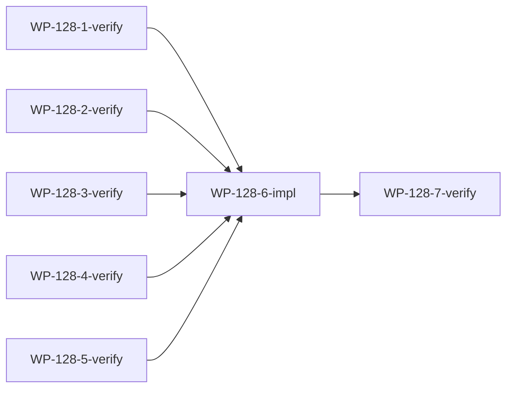

# WP-128: v0.2.0 三次校验与修复

## 🤖 Subagent 读取指令

> **重要**: 此文档包含完整的任务上下文。执行前请阅读以下内容：
> - **问题分析**: WP-112~WP-127 已完成两轮校验（WP-125、WP-126）和一轮修复（WP-127），需要新一轮独立校验
> - **实施计划**: 按 5 功能域并行校验，汇总问题后修复，回归测试
> - **关键文件**: 见各子工作包文档
> - **验收标准**: 5 域校验通过 + 问题修复 + 决策讨论 + 回归测试通过

## 基本信息

| 属性 | 值 |
|------|-----|
| **优先级** | P0 |
| **预估AI时间** | 150min |
| **拆分模式** | fine-grained |
| **状态** | 📋 待执行 |

## 复杂度评估

| 维度 | 评分 | 说明 |
|------|------|------|
| 文件影响范围 | 3 | 涉及 30+ 源文件和 18 测试文件 |
| 模块数量 | 3 | 安全/沙箱、架构/模块化、插件生态、测试质量、工程标准 |
| 接口变更程度 | 1 | 纯校验+可能的小修复 |
| 测试用例预估 | 3 | 运行 600+ 测试 |
| 预估AI时间 | 3 | 预计 >30min |
| **总分** | **13** | fine-grained 模式 |

## 子工作包列表

| ID | 类型 | 职责 | 依赖 | 执行角色 | 状态 |
|----|------|------|------|----------|------|
| WP-128-1-verify | 校验 | 安全与沙箱域（WP-112, WP-117, WP-127）| - | tester | 📋 |
| WP-128-2-verify | 校验 | 架构与模块化域（WP-113, WP-115, WP-119）| - | tester | 📋 |
| WP-128-3-verify | 校验 | 插件生态域（WP-120, WP-121）| - | tester | 📋 |
| WP-128-4-verify | 校验 | 测试与质量域（WP-114, WP-118, WP-122）| - | tester | 📋 |
| WP-128-5-verify | 校验 | 工程标准域（WP-116, WP-123, WP-124, WP-125, WP-126）| - | tester | 📋 |
| WP-128-6-impl | 修复 | 汇总问题、修复、决策讨论 | WP-128-1~5 | implementer | ✅ |
| WP-128-7-verify | 验证 | 修复后回归测试 | WP-128-6 | tester | ✅ |

## 依赖关系图

## 目标

对 WP-112~WP-127 全部成果进行独立的三次校验，确认：
1. 每个 WP 的交付物存在且正确
2. 代码质量符合标准
3. 测试全部通过且覆盖率达标
4. 跨模块一致性良好
5. 前序修复无回归
6. 发现问题后修复并讨论决策

## 各域校验范围

### 安全与沙箱域（WP-128-1-verify）

校验 WP-112（安全最小集）+ WP-117（Worker Threads 沙箱）+ WP-127（修复确认）。

**关键文件**:
- `commands/install.js` — confirmInstall()
- `plugins/runtime/sandbox-manager.js` — SandboxManager
- `plugins/runtime/sandbox-context.js` — RPC 代理
- `plugins/runtime/sandbox-worker.js` — Worker 执行
- `plugins/contracts/capabilities.js` — Capability 枚举
- `plugins/runtime/audit-logger.js` — JSONL 审计
- `plugins/runtime/plugin-validator.js` — validateCapabilities()
- `plugins/runtime/harness-build.js` — 来源警告
- 测试文件: test-wp112-security.js, test-sandbox-manager.js, test-sandbox-context.js, test-capabilities.js, test-audit-logger.js

**检查项**:
1. confirmInstall() 交互/非交互模式行为
2. capabilities 结构验证覆盖完整
3. SandboxManager Worker 生命周期
4. RPC 代理通信正确
5. 三级信任模型强制执行
6. AuditLogger JSONL 格式和查询
7. WP-127 修复无回归

### 架构与模块化域（WP-128-2-verify）

校验 WP-113（harness-build 模块化）+ WP-115（Schema 形式化）+ WP-119（API 稳定性分类）。

**关键文件**:
- `plugins/runtime/yaml-parser.js`
- `plugins/runtime/plugin-validator.js`
- `plugins/runtime/settings-merger.js`
- `plugins/runtime/claude-md-injector.js`
- `plugins/runtime/harness-build.js` — 代理模式
- `plugins/contracts/plugin-schema.json`
- `bin/context.js`

**检查项**:
1. harness-build.js 代理到拆分模块正确性
2. yaml-parser 解析所有字段
3. settings-merger 本地/全局路径
4. claude-md-injector 幂等注入
5. plugin-schema.json 字段覆盖
6. 23 个核心插件 schema 验证
7. API 稳定性标注完整性

### 插件生态域（WP-128-3-verify）

校验 WP-120（Manifest 扩展）+ WP-121（Provider 依赖链）。

**关键文件**:
- `plugins/runtime/manifest-resolver.js`
- `plugins/runtime/plugin-loader.js`
- `plugins/runtime/resolve-plugin-path.js`

**检查项**:
1. 外部插件注册/注销/列表 API
2. manifest 合并外部插件
3. _buildDependencyGraph providers 依赖
4. _buildProviderMap 映射
5. 循环依赖检测
6. resolve-plugin-path 三种源类型

### 测试与质量域（WP-128-4-verify）

校验 WP-114（测试补全）+ WP-118（E2E 测试）+ WP-122（覆盖率基线）。

**关键文件**:
- `test/runtime/test-validator-pipeline.js`
- `test/runtime/test-hook-dispatcher.js`
- `test/runtime/test-manifest-resolver.js`
- `test/runtime/test-skill-structure.js`
- `test/e2e/test-init-build-validate.js`
- `package.json` — test:coverage 脚本
- `.github/workflows/ci.yml` — coverage job

**检查项**:
1. validator-pipeline 覆盖率 ≥75%
2. hook-dispatcher 覆盖率 ≥70%
3. manifest-resolver 覆盖率 ≥75%
4. E2E init→build→validate 流程
5. E2E global/local 模式
6. test:coverage 配置
7. CI 70% 门槛

### 工程标准域（WP-128-5-verify）

校验 WP-116（CI 矩阵）+ WP-123（工程卫生）+ WP-124（迁移路径）+ WP-125/126（前序校验成果）。

**关键文件**:
- `.github/workflows/ci.yml`
- `CONTRIBUTING.md`
- `commands/migrate.js`
- `package-lock.json`

**检查项**:
1. CI 矩阵 3 OS × 2 Node
2. CONTRIBUTING.md 完整性
3. package-lock.json 同步
4. migrate 升级路径
5. WP-125 修复无回归
6. WP-126 修复无回归
7. WP-119 状态标记一致性

## 验收标准

- [ ] WP-128-1~5 五域校验全部 PASS
- [ ] 发现的问题全部修复
- [ ] 决策点已与用户讨论
- [ ] WP-128-7 回归测试通过（0 失败）
- [ ] 全量测试 600+ 测试通过
