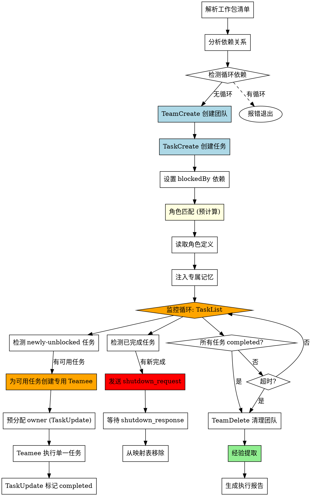

# Agent Dispatcher (Agent Teams 版)

基于 **Claude Code Agent Teams** 机制的子代理批量任务调度技能，支持角色赋能和记忆注入。

## When to Use

**触发词**:
- "批量执行" / "并行执行"
- "调度子代理" / "派发任务"
- "执行工作包 WP-XXX, WP-YYY"
- "开始批量任务"

## ⚠️ 权限要求

本 skill 的 Step 7 清理流程需要 Bash 工具权限来：
- 验证目录是否存在 (`test -d`)
- 在 TeamDelete 失败时执行文件系统级删除 (`rm -rf`)

**建议权限配置**（添加到 settings.json 的 `permissions.allow` 中）：
```json
{
  "allow": [
    "Bash(test -d $HOME/.claude/teams/*)",
    "Bash(test -d $HOME/.claude/tasks/*)",
    "Bash(rm -rf $HOME/.claude/teams/*)",
    "Bash(rm -rf $HOME/.claude/tasks/*)"
  ]
}
```

如果权限被拒绝，清理流程会提示用户手动执行 `清理团队`。

## Quick Reference

| 场景 | 执行方式 |
|------|----------|
| 无依赖的多个工作包 | 并行执行 (每 WP 一个专用 Teamee) |
| 有依赖链的工作包 | blockedBy 阻塞 + 依赖解除后按需创建 Teamee |
| 混合依赖 | 监控循环动态创建 + 即时销毁 |

---

## Architecture

```
┌─────────────────────────────────────────────────────────────┐
│                      Team Lead (主 Agent)                    │
│                                                             │
│  1. 解析工作包 → 分析依赖                                     │
│  2. TeamCreate 创建团队                                      │
│  3. TaskCreate 创建任务 + 设置 blockedBy                      │
│  4. 角色匹配 → 预计算每个 WP 的角色和记忆                      │
│  5. 监控循环:                                                │
│     - 检测 newly-unblocked 任务 → 按需创建专用 Teamee (1:1)  │
│     - 检测已完成的任务 → 即时销毁对应 Teamee                   │
│     - 维护映射表 {task_id → teamee_name}                     │
│  6. 全部完成后 TeamDelete                                     │
│  7. 经验提取 + completion-report                              │
└─────────────────────────────────────────────────────────────┘
                              │
        ┌─────────────────────┼─────────────────────┐
        ▼                     ▼                     ▼
  ┌──────────┐          ┌──────────┐          ┌──────────┐
  │ Teamee A │          │ Teamee B │          │ Teamee C │
  │ WP-037   │          │ WP-038   │          │ WP-039   │
  │ 专用绑定  │          │ 专用绑定  │          │ 专用绑定  │
  └────┬─────┘          └────┬─────┘          └────┬─────┘
       │ 已完成              │ 执行中               │ blockedBy #2
       │ 即时销毁            │                     │ 等待创建
       ▼                     ▼                     ▼
              ┌───────────────────────────────┐
              │     共享 Task List            │
              │  Task #1: WP-037 (completed)  │
              │  Task #2: WP-038 (in_progress)│
              │  Task #3: WP-039 (blockedBy #2)│
              └───────────────────────────────┘
```

---

## Flow



---

## Step-by-Step Implementation

### Step 1: 解析工作包 + 分析依赖

```
1. 读取 task.md 获取下一个可用 WP 编号
2. 提取待执行工作包的依赖关系
3. 构建依赖图，检测循环依赖
4. 确定执行顺序（拓扑排序）
```

### Step 2: 创建团队

```
TeamCreate:
  team_name: "batch-{YYYYMMDD}-{work-package-ids}"
  description: "批量执行 {WP-XXX, WP-YYY}"
```

**命名规范**：
- 单工作包: `batch-20260314-WP073`
- 批量工作包: `batch-20260314-WP073-075`

### Step 3: 创建任务 + 设置依赖

```
# 为每个工作包创建 Task

TaskCreate:
  subject: "WP-037: 凝视区域形状升级"
  description: |
    ## 📖 必读：工作包文档

    **执行前请先阅读工作包文档获取完整上下文：**
    - 文档路径: `docs/wp/WP-037.md`
    - 包含: 问题分析、实施计划、关键文件、验收标准

    ---

    {工作包简要描述}
  status: pending

# 设置依赖关系
TaskUpdate:
  taskId: "{依赖任务的 ID}"
  addBlockedBy: ["{被依赖任务的 ID}"]
```

**⚠️ 重要**: description 必须包含工作包文档路径，让 Subagent 知道从哪里获取完整上下文！

**示例**：
```
WP-037 无依赖 → Task #1, 无 blockedBy
WP-038 依赖 WP-037 → Task #2, blockedBy: [#1]
WP-039 依赖 WP-038 → Task #3, blockedBy: [#2]
```

### Step 4: 角色匹配

```python
def match_role(work_package):
    """匹配最合适的角色"""
    scores = {}

    for role in roles:
        score = 0
        # 关键词匹配 (权重 0.5)
        for keyword in work_package.keywords:
            if keyword in role.keywords:
                score += 0.5

        # 任务类型匹配 (权重 0.3)
        if work_package.type in role.task_types:
            score += 0.3

        # 模块标签匹配 (权重 0.2)
        for tag in work_package.tags:
            if tag in role.module_tags:
                score += 0.2

        scores[role.id] = score

    return max(scores, key=scores.get)
```

### Step 5: 预计算角色 + 记忆准备

**⚠️ 重要**: 角色匹配和记忆注入在监控循环之前完成（预计算），为每个工作包准备好角色 Prompt。

```
# 预计算所有工作包的角色匹配结果和记忆

wp_assignments = {}  # {task_id: {role_id, role_prompt, memories, wp_doc_path}}

for task in tasks:
    wp = extract_work_package(task)
    role = match_role(wp)
    memories = load_memories(role.id)
    wp_assignments[task.id] = {
        "role_id": role.id,
        "role_prompt": role.prompt_template,
        "memories": memories,
        "wp_doc_path": wp.doc_path
    }
```

**为什么预计算**:
- 监控循环中按需创建 Teamee 时，直接使用预计算结果构建 Prompt
- 避免在监控循环中重复执行角色匹配逻辑
- 角色匹配算法不变（仍使用 Step 4 中的算法）

### Step 6: 初始创建 Teamee（首次可用任务）

<HARD-GATE>
Step 5 完成后，立即检查有哪些任务的 blockedBy 已满足。
为每个 initially-unblocked 的任务创建专用 Teamee。
不可跳过此步骤！
</HARD-GATE>

**⚠️ 重要**: 必须使用 `general-purpose` subagent_type！

不要使用 `Explore` 或其他只读 agent 类型，因为它们没有 SendMessage 工具，
无法响应 shutdown_request，会导致即时销毁流程失败。

```
# 初始化映射表
teamee_map = {}  # {task_id: teamee_name}

# 检查哪些任务在初始时就没有阻塞
tasks = TaskList()
for task in tasks:
    if task.status == "pending" and is_unblocked(task):
        # 从预计算结果获取角色信息
        assignment = wp_assignments[task.id]

        # 生成唯一的 Teamee 名称（包含 task_id 和 role）
        teamee_name = f"{assignment.role_id}-t{task.id}"

        # 预分配 owner
        TaskUpdate(taskId=task.id, owner=teamee_name)

        # 创建专用 Teamee
        Agent(
            name=teamee_name,
            team_name="{team_name}",
            subagent_type="general-purpose",  # 必须使用 general-purpose
            prompt=build_single_task_prompt(
                teamee_name=teamee_name,
                task_id=task.id,
                role_prompt=assignment.role_prompt,
                memories=assignment.memories,
                wp_doc_path=assignment.wp_doc_path
            )
        )

        # 记录映射关系
        teamee_map[task.id] = teamee_name
```

**为什么不能用 Explore agent**:
- Explore agent 的工具集: `All tools except Agent, ExitPlanMode, Edit, Write, NotebookEdit`
- 没有 Agent 工具 = 没有 SendMessage
- 无法发送 `shutdown_response` = 即时销毁失败 = 资源泄漏

### Step 6.5: 监控循环 (🔴 关键步骤 — 动态创建 + 即时销毁)

<HARD-GATE>
Lead Agent 必须进入监控循环，不可跳过！
此循环负责:
1. 检测 newly-unblocked 任务 → 按需创建专用 Teamee
2. 检测已完成任务 → 即时销毁对应 Teamee
3. 判断全部完成 → 退出循环
这是保证资源及时释放和依赖正确解析的核心机制。
</HARD-GATE>

```
# Lead Agent 监控循环
loop_interval = 30  # 秒
max_wait_time = 7200  # 2 小时
shutdown_timeout = 15  # 等待 Teamee shutdown 响应的超时

start_time = now()
while (now() - start_time) < max_wait_time:
    # ---- Phase A: 获取任务状态 ----
    tasks = TaskList()

    # ---- Phase B: 即时销毁已完成的 Teamee ----
    for task in tasks:
        if task.status == "completed" and task.id in teamee_map:
            teamee_name = teamee_map[task.id]
            print(f"任务 {task.id} 已完成，即时销毁 Teamee: {teamee_name}")

            # B1. 发送 shutdown_request
            SendMessage(to=teamee_name, message={
                "type": "shutdown_request",
                "reason": f"任务 {task.id} 已完成，释放资源",
                "request_id": f"shutdown-{task.id}-{timestamp()}"
            })

            # B2. 等待 shutdown_response（最多 shutdown_timeout 秒）
            #     Teamee 收到后应回复 {"type":"shutdown_response","approve":true}
            #     如果超时未响应，继续执行（不阻塞循环）

            # B3. 从映射表移除
            del teamee_map[task.id]
            print(f"Teamee {teamee_name} 已销毁并从映射表移除")

    # ---- Phase C: 按需创建 Teamee 处理 newly-unblocked 任务 ----
    for task in tasks:
        if task.status == "pending" and task.owner == "" and is_unblocked(task):
            # C1. 检查是否已有映射（防止重复创建）
            if task.id in teamee_map:
                continue

            # C2. 从预计算结果获取角色信息
            assignment = wp_assignments[task.id]
            teamee_name = f"{assignment.role_id}-t{task.id}"

            # C3. 预分配 owner
            TaskUpdate(taskId=task.id, owner=teamee_name)

            # C4. 创建专用 Teamee
            Agent(
                name=teamee_name,
                team_name="{team_name}",
                subagent_type="general-purpose",
                prompt=build_single_task_prompt(
                    teamee_name=teamee_name,
                    task_id=task.id,
                    role_prompt=assignment.role_prompt,
                    memories=assignment.memories,
                    wp_doc_path=assignment.wp_doc_path
                )
            )

            # C5. 记录映射关系
            teamee_map[task.id] = teamee_name
            print(f"为任务 {task.id} 创建专用 Teamee: {teamee_name}")

    # ---- Phase D: 判断退出条件 ----
    completed = count(status == "completed")
    total = len(tasks)

    if completed == total:
        print("所有任务完成，退出监控循环")
        break

    # Phase D2: 异常检测
    in_progress = count(status == "in_progress")
    pending = count(status == "pending")
    if pending > 0 and in_progress == 0 and len(teamee_map) == 0:
        print("异常: 有待处理任务但无活跃 Teamee 且无映射")
        break

    sleep(loop_interval)

# 超时处理
if (now() - start_time) >= max_wait_time:
    print("监控超时，强制执行清理")
    # 销毁所有剩余的 Teamee
    for task_id, teamee_name in teamee_map.items():
        SendMessage(to=teamee_name, message={
            "type": "shutdown_request",
            "reason": "监控超时，强制清理",
            "request_id": f"force-shutdown-{task_id}-{timestamp()}"
        })
```

**辅助函数 — 判断任务是否已解除阻塞**:
```
def is_unblocked(task):
    """检查任务的所有 blockedBy 依赖是否都已满足"""
    if not task.blockedBy:
        return True
    all_tasks = TaskList()
    for blocker_id in task.blockedBy:
        blocker = find_by_id(all_tasks, blocker_id)
        if blocker.status != "completed":
            return False
    return True
```

**监控循环关键特性**:
- **Phase B (即时销毁)** 在 Phase C (创建) 之前执行，确保资源先释放再分配
- 每次循环都检查 `teamee_map` 防止重复创建/重复销毁
- 异常检测同时检查 `teamee_map` 是否为空，避免误判

### Step 7: 清理团队 (🔴 强制执行 + 验证)

<HARD-GATE>
TeamDelete 必须执行，且必须验证结果！
注意：大部分 Teamee 已在 Step 6.5 监控循环中即时销毁。
此步骤负责最终的 TeamDelete 调用和验证。
不信任 TeamDelete 返回值，必须检查目录是否真的被删除！
以下步骤必须按顺序逐一执行，不可跳过！
</HARD-GATE>

> **设计说明**: 以下使用显式步骤而非循环，确保 AI agent 能忠实执行每一步。
> 路径使用 `$HOME` 变量（Git Bash 兼容 Windows）。

---

#### Step 7a: 安全检查（3 个前置条件）

**条件 1** — `team_name` 非空且仅含合法字符 `[a-zA-Z0-9_-]`
- 失败 → 打印 `❌ 错误：team_name 无效` → 提示手动执行 `清理团队` → **停止**

**条件 2** — 团队目录存在
- 用 Bash 检查: `test -d "$HOME/.claude/teams/$team_name" && echo "EXISTS" || echo "NOT_FOUND"`
- 返回 `NOT_FOUND` → 打印 `ℹ️ 团队目录不存在，可能已被清理，跳过` → **停止**

**条件 3** — 路径安全验证
- 用 Bash 检查: `basename "$HOME/.claude/teams/$team_name"` 应返回 `$team_name`
- 不匹配 → 打印 `❌ 安全检查失败：路径异常` → 提示手动执行 `清理团队` → **停止**

全部通过 → 继续 Step 7b

---

#### Step 7b: 发送 shutdown_request (清理残留 Teamee)

检查 `teamee_map` 中是否还有未销毁的 Teamee:
```
# 检查映射表中是否还有残留 Teamee
if teamee_map is not empty:
    print(f"⚠️ 发现 {len(teamee_map)} 个未销毁的 Teamee，发送 shutdown_request")
    for task_id, teamee_name in teamee_map.items():
        SendMessage(to=teamee_name, message={
            "type": "shutdown_request",
            "reason": "最终清理阶段，准备 TeamDelete",
            "request_id": f"final-shutdown-{task_id}-{timestamp()}"
        })
else:
    print("所有 Teamee 已在监控循环中即时销毁，无需额外 shutdown")

# 额外安全网: 读取团队配置检查是否有遗漏的成员
# (防止映射表不一致的情况)
config = Read("~/.claude/teams/$team_name/config.json")
for member in config.members:
    if member.name != "team-lead" and member.name not in teamee_map.values():
        SendMessage(to=member.name, message={
            "type": "shutdown_request",
            "reason": "最终清理阶段，发现未在映射表中的成员",
            "request_id": f"orphan-shutdown-{member.name}-{timestamp()}"
        })
```

---

#### Step 7c: 等待 shutdown 响应（最多 15 秒）

等待所有 Teamee 的 `shutdown_response`。
如果 15 秒内未全部响应，不再等待，继续执行清理。

---

#### Step 7d: 执行 TeamDelete（第 1 次）

调用 `TeamDelete()` 工具。

**验证** — 用 Bash 检查目录是否真的被删除:
```bash
test -d "$HOME/.claude/teams/$team_name" && echo "EXISTS" || echo "GONE"
test -d "$HOME/.claude/tasks/$team_name" && echo "EXISTS" || echo "GONE"
```

- 两个都返回 `GONE` → 打印 `✅ 清理成功（验证通过）` → **跳到 Step 7g**
- 任一返回 `EXISTS` → 继续 Step 7e

---

#### Step 7e: 执行 TeamDelete（第 2 次，等待 2 秒后重试）

调用 `TeamDelete()` 工具。

**验证** — 同 Step 7d 的 Bash 检查。

- 两个都返回 `GONE` → 打印 `✅ 清理成功（第 2 次尝试）` → **跳到 Step 7g**
- 任一返回 `EXISTS` → 继续 Step 7f

---

#### Step 7f: 文件系统级强制清理（TeamDelete 回退方案）

打印 `🔥 TeamDelete 两次失败，执行文件系统级清理...`

**安全确认** — 再次验证路径:
```bash
basename "$HOME/.claude/teams/$team_name"
```
- 返回值不等于 `$team_name` → 打印 `❌ 安全检查失败` → 提示手动执行 `清理团队` → **停止**

**执行删除**（逐个目录，检查存在后再删）:
```bash
# 删除团队目录（仅当存在时）
test -d "$HOME/.claude/teams/$team_name" && rm -rf "$HOME/.claude/teams/$team_name" && echo "DELETED" || echo "SKIP_OR_FAIL"

# 删除任务目录（仅当存在时）
test -d "$HOME/.claude/tasks/$team_name" && rm -rf "$HOME/.claude/tasks/$team_name" && echo "DELETED" || echo "SKIP_OR_FAIL"
```

如果 Bash `rm -rf` 权限被拒绝:
- 打印 `⚠️ 权限不足，无法执行文件系统删除`
- 提示用户手动执行 `清理团队` 或 `rm -rf "$HOME/.claude/teams/$team_name" "$HOME/.claude/tasks/$team_name"`

---

#### Step 7g: 最终验证

用 Bash 确认两个目录都已清除:
```bash
test -d "$HOME/.claude/teams/$team_name" && echo "STILL_EXISTS" || echo "CLEAN"
test -d "$HOME/.claude/tasks/$team_name" && echo "STILL_EXISTS" || echo "CLEAN"
```

- 两个都返回 `CLEAN` → 打印 `✅ 清理流程完成`
- 任一返回 `STILL_EXISTS` → 打印 `❌ 清理失败！请手动执行: 清理团队`

---

#### Step 7h: 记录清理日志

记录清理结果到执行报告（成功/失败、尝试次数、使用的方法）。

---

## Teamee Prompt 模板

```markdown
# [角色名称] - 单一任务专用执行

## 你的身份
{角色 prompt_template}

## 团队信息
- 团队名称: {team_name}
- 你的角色: {role_id}

## 任务绑定 (1:1 专用)

**⚠️ 重要：你只负责处理一个任务，不可认领其他任务！**

- 分配给你的任务 ID: {task_id}
- 任务主题: {task_subject}
- 完成此任务后，你将被立即销毁释放资源
- **禁止** 认领或执行其他任务
- 可以调用 TaskList 查看全局进度，但仅限查看，不可对其他任务执行 TaskUpdate

## 📖 首要任务：阅读工作包文档

**执行任何任务前，必须先读取工作包文档！**

```
1. 确认任务后，立即读取任务 description 中指定的工作包文档
2. 工作包文档路径格式: `docs/wp/WP-XXX.md` 或 `docs/wp/WP-XXX-N-type.md`
3. 从文档中获取:
   - 问题分析/上下文
   - 实施计划 Step 1-N
   - 关键文件列表
   - 验收标准
```

## 工作流程 (必须严格遵守)

### 1. 确认任务分配
```
# 你的任务已由 Lead 预分配，直接确认
TaskGet(taskId="{task_id}")
# 验证 owner 是你、status 是 pending 或 in_progress
```

### 2. 开始执行
- 立即将 status 改为 "in_progress"
- TaskUpdate(taskId="{task_id}", status="in_progress")
- 读取工作包文档获取完整上下文
- 按任务描述执行
- 完成验收标准

### 3. 完成任务
```
TaskUpdate(taskId="{task_id}", status="completed")
```

### 4. 等待关闭 (🔴 必须响应)

**完成任务后，不要查找其他任务！直接等待 Lead 的 shutdown_request。**

当收到 `shutdown_request` 消息时，**必须**发送响应：

```
# 从收到的 shutdown_request 中提取 request_id
# 然后发送 shutdown_response

SendMessage(
    to="team-lead",
    message={
        "type": "shutdown_response",
        "request_id": "{从 shutdown_request 中提取的 request_id}",
        "approve": true
    }
)
```

发送响应后，你的工作结束，可以退出。

**⚠️ 禁止事项**:
- 不要认领或执行其他任务（可以查看 TaskList 了解进度，但不可对其他任务执行 TaskUpdate）
- 不要在完成后继续工作
- 必须等待 Lead 的 shutdown_request，不要主动退出

## 相关经验（从历史中学习）

### 经验 1: {标题}
**问题**: {problem}
**解决方案**: {solution}

## 项目上下文
- 项目: Kings Watching (Godot 4.x 卡牌塔防游戏)
- Godot 版本: 4.6.1

## 输出要求
1. 修改/新增的文件清单
2. 验收标准完成情况
3. 遇到的问题和解决方案
4. **如有新经验，请按以下格式总结**：
   ```
   ### [标签] 经验标题
   **问题**: ...
   **解决方案**: ...
   ```

## 任务完成后必须执行 (Critical!)

### 状态同步 (不可跳过)
完成工作包后，你必须更新以下文档：

1. **更新 task.md**:
   - 将工作包状态从 `📋 待开始` 改为 `✅ 完成`
   - 添加到"最近完成"列表

2. **更新 docs/wp/WP-XXX.md** (如存在):
   - 更新状态为 ✅ 完成
   - 添加完成日期

3. **验证同步**:
   - 重新读取 task.md 确认状态已更新

⚠️ 如果不执行状态同步，工作包将被视为未完成！

## 重要提醒
- **你只处理一个任务** — 完成后等待 shutdown，不要查找其他任务
- 完成后必须执行测试验证
- 如遇阻塞问题，在任务描述中说明阻塞原因
- 不要跳过任何验收标准
- 任务完成后立即更新状态为 completed，方便 Lead 检测并解锁依赖任务
- 收到 shutdown_request 后立即响应，不要延迟
```

---

## 角色赋能系统

### 核心角色（通用框架）

| 角色ID | 名称 | 匹配关键词 |
|--------|------|------------|
| `coordinator` | 协调者 | 调度、协调、监控、分配、统筹 |
| `architect` | 架构师 | 架构、设计、结构、模块、接口 |
| `implementer` | 实现者 | 实现、编码、开发、修复、重构 |
| `tester` | 测试者 | 测试、验证、检查、单元测试 |
| `documenter` | 文档编写者 | 文档、说明、注释、README |

### 领域角色（由项目模板扩展）

| 角色ID | 名称 | 匹配关键词 |
|--------|------|------------|
| `frontend-dev` | 前端开发 | 前端、UI、组件、样式 |
| `backend-dev` | 后端开发 | 后端、API、服务、数据库 |
| `devops` | 运维专家 | 部署、CI/CD、Docker、容器 |
| `godot-scene-expert` | Godot 场景+UI专家 | 场景、节点、tscn、UI（Godot模板）|

### 角色文件位置

| 文件类型 | 路径 |
|----------|------|
| 角色注册表 | `.claude/agents/role-registry.yaml` |
| 元角色定义 | `.claude/agents/roles/meta/{role_id}.yaml` |
| 职能角色定义 | `.claude/agents/roles/functional/{role_id}.yaml` |
| 领域角色定义 | `.claude/agents/roles/domain/{role_id}.yaml` |
| 专属经验库 | `.claude/agents/memories/{role_id}.md` |

---

## 记忆注入机制

### 经验提取逻辑

1. **读取角色专属库**：`.claude/agents/memories/{role_id}.md`
2. **回退机制**：如专属库不足，读取 `docs/EXPERIENCE.md`
3. **按标签过滤**：使用角色的 `experience_tags` 过滤
4. **动态数量**：
   - 简单任务（<2h）：1-2 条
   - 中等任务（2-4h）：3 条
   - 复杂任务（>4h）：5 条

---

## 共享上下文机制

### 自动共享 (无需干预)

| 资源 | 共享方式 |
|------|----------|
| `CLAUDE.md` | 所有 Teamee 自动加载 |
| Skills | 继承 Lead 的 skills |
| MCP Servers | 共享相同的 MCP 配置 |
| 项目代码 | 共享同一工作目录 |

### 协调共享 (通过 Task List)

```
┌─────────────────────────────────────────────────┐
│              Task List (共享状态)                │
│                                                 │
│  Task #1: 状态=completed, Owner=scene-expert-t1 │
│  Task #2: 状态=in_progress, Owner=script-expert-t2 │
│  Task #3: 状态=pending, blockedBy=[#2], Owner="" │
│  (Task #3 等待 #2 完成后 Lead 创建专用 Teamee)    │
└─────────────────────────────────────────────────┘
```

### 主动共享 (通过 SendMessage)

| 消息类型 | 用途 |
|----------|------|
| `message` | Lead ↔ Teamee 点对点通信 |
| `broadcast` | Lead → 全体通知 |
| `shutdown_request` | Lead 请求 Teamee 关闭 |

---

## Dependency Analysis

### 依赖图构建

1. **读取工作包清单** - 获取所有待执行工作包
2. **解析依赖声明** - 提取 `依赖: WP-XXX` 信息
3. **构建有向图** - 节点=工作包，边=依赖关系
4. **拓扑排序** - 确定执行顺序
5. **检测循环依赖** - 如有循环则报错

### 循环依赖检测

```
❌ 检测到循环依赖: WP-037 → WP-038 → WP-039 → WP-037
请手动解除依赖关系后重试。
```

---

## Execution Report

批量执行完成后生成汇总报告，存放到 `docs/reports/` 目录。

### 报告命名规范

```
docs/reports/{YYYY-MM-DD}_{工作包列表}_execution_report.md
```

**单工作包**:
```
docs/reports/2026-03-14_WP-073_execution_report.md
```

**批量工作包**:
```
docs/reports/2026-03-14_WP-073-075_execution_report.md
```

### 报告内容模板

```markdown
# 批量执行报告

## 基本信息
- 团队名称: batch-20260314-WP073-075
- 执行日期: 2026-03-14
- 工作包: WP-073, WP-074, WP-075

## 执行总览

| Task ID | 工作包 | 角色 | 状态 | 依赖 | 说明 |
|---------|--------|------|------|------|------|
| #1 | WP-073 | godot-scene-expert | ✅ 完成 | - | - |
| #2 | WP-074 | godot-script-expert | ✅ 完成 | #1 | - |
| #3 | WP-075 | combat-ai-expert | ✅ 完成 | #2 | - |

## 详细结果

### WP-073: 凝视区域形状升级
- 执行者: godot-scene-expert
- 子任务: 3/3 完成
- 测试: 9/9 通过
- 文件变更:
  - 新增: 2 个
  - 修改: 3 个

### WP-074: ...
(类似)

## 📁 文件变更汇总
```
新增: X 个文件
修改: Y 个文件
测试: Z 个文件
```

## 💡 新增经验
(如有新经验，已写入角色专属库)

---
报告生成时间: {timestamp}
```

---

## 经验沉淀闭环

执行完成后：

1. **分析 Teamee 输出** - 提取新经验
2. **写入角色专属库** - `.claude/agents/memories/{role_id}.md`
3. **同步到 EXPERIENCE.md** - 去重合并
4. **触发 experience-logger** - 记录本次执行的经验

---

## 🆕 拆分工作包执行支持

当工作包有子工作包时，agent-dispatcher 会自动识别并按依赖调度。

### 执行流程

```
1. 读取父工作包文档 (docs/wp/WP-XXX.md)
2. 检测拆分模式 (simple/standard/fine-grained)
3. 解析子工作包列表
4. 解析依赖关系
5. 创建 Task List 任务
6. 设置 blockedBy 依赖
7. 角色匹配 → 分配角色
8. 按依赖顺序调度执行
9. 验证关卡机制:
   - verify 失败 → 停止后续任务
   - 所有 verify 通过 → 标记完成
```

### 拆分模式处理

#### 模式 A: simple (不拆分)
直接作为单个任务调度执行。

#### 模式 B: standard (标准拆分)
生成 4 个子任务：
- WP-XXX-1-impl → 领域专家
- WP-XXX-2-test → test-reviewer (blockedBy: #1)
- WP-XXX-3-verify → test-reviewer (blockedBy: #2)
- WP-XXX-4-review → code-reviewer (blockedBy: #3)

#### 模式 C: fine-grained (细粒度拆分)
按模块拆分为多个实现任务，每个模块独立测试，最后统一验证和审查。

### 验证关卡机制

当 `-verify` 工作包执行失败时：
1. 停止所有依赖此工作包的后续任务
2. 通知 Lead 验证失败
3. 等待用户指示

当 `-verify` 工作包通过时：
1. 解锁 `-review` 任务
2. 继续执行流程

### 角色自动匹配

| 子工作包类型 | 自动匹配角色 |
|--------------|--------------|
| `-impl` | 根据关键词匹配领域专家 |
| `-test` | test-reviewer |
| `-verify` | test-reviewer |
| `-review` | code-reviewer |

---

## Integration with Other Skills

| Skill | 集成点 |
|-------|--------|
| `role-manager` | 查看角色、手动匹配 |
| `human-checkpoint` | 批量执行前确认执行计划 |
| `completion-report` | 批量执行后生成报告 |
| `checklist` | 每个工作包完成后检查 |
| `experience-logger` | 批量执行后记录经验 |
| `task-creator` | 🆕 支持拆分工作包创建 |
| `batch-task-creator` | 🆕 支持批量拆分 |

---

## Error Handling

### 循环依赖
```
❌ 检测到循环依赖: WP-037 → WP-038 → WP-039 → WP-037
请手动解除依赖关系后重试。
```

### 角色匹配失败
```
⚠️ 无法自动匹配角色，使用默认 general-purpose
工作包: WP-XXX
建议手动指定角色
```

### Teamee 执行失败
```
⚠️ Task #2 执行失败
Owner: godot-script-expert-t2
状态: in_progress (卡住)
处理: Lead 发送 shutdown_request 即时销毁该 Teamee
      从 teamee_map 移除映射
      创建新 Teamee 重试 或 人工介入
```

### 部分任务超时
```
⚠️ Task #3 等待依赖超时
依赖: Task #2 (状态: in_progress, 超过 30 分钟)
处理: 检查 Task #2 的 Teamee 状态
      必要时发送消息确认进度
```

### 清理超时
```
⚠️ 清理等待超时（30秒）
可能原因：
- Teamee 没有响应 shutdown_request
- Teamee 使用了 Explore 等只读 agent（没有 SendMessage 工具）
- Teamee 进程卡死

处理：
- 强制执行 TeamDelete（不是 rm -rf！）
- 建议用户检查是否有残留进程
- 检查 Step 5 是否使用了正确的 subagent_type
```

---

## Important

1. **TeamCreate 是必须的** - 没有团队就没有共享 Task List
2. **blockedBy 自动阻塞** - 依赖机制由 Task List 自动处理
3. **Lead 按需分配 (1:1)** - 每个 WP 由 Lead 创建专用 Teamee 并预分配，禁止一个 Teamee 处理多个 WP
4. **即时销毁** - Teamee 完成任务后立即销毁释放资源，不等到全部完成
5. **角色匹配提升质量** - 专业角色比通用代理更高效
6. **记忆注入避免踩坑** - 从历史经验中学习
7. **经验沉淀形成闭环** - 每次执行都让角色更聪明
8. **🔴 TeamDelete 是强制的** - 无论成功/失败/超时，都必须执行清理！
9. **🔴 监控循环不可跳过** - Lead 必须进入 Step 6.5 监控循环，负责动态创建和即时销毁

## Cleanup Guarantee (清理保障)

```
┌─────────────────────────────────────────────────────────────┐
│                    强制清理检查点                             │
│                                                             │
│  ✅ 正常完成 → Step 6.5 即时销毁 → Step 7 最终清理 → TeamDelete │
│  ✅ 部分失败 → Step 6.5 即时销毁 → Step 7 最终清理 → TeamDelete │
│  ✅ 超时     → Step 6.5 超时销毁 → Step 7 强制清理 → TeamDelete │
│  ✅ 异常中断 → 捕获中断 → Step 7 强制销毁残留 → TeamDelete     │
│                                                             │
│  ❌ 无任何情况可以跳过 TeamDelete！                          │
└─────────────────────────────────────────────────────────────┘
```

---

## Migration Guide (从旧版本迁移)

### 旧版本 vs 新版本

| 操作 | 旧版本 | 新版本 |
|------|--------|--------|
| 创建协调 | 无 | TeamCreate |
| 任务管理 | 主 Agent 手动 | TaskCreate + TaskList |
| 依赖处理 | 主 Agent 分析 | blockedBy 自动阻塞 |
| 任务分配 | 主 Agent 指定 | Lead 按需创建 + 预分配 (1:1 绑定) |
| 状态同步 | 无 | TaskList 实时 |
| Teamee 生命周期 | 无管理 | 按需创建 / 即时销毁 |
| 清理 | 无 | TeamDelete |

### 保留的功能

- ✅ 角色匹配算法
- ✅ 记忆注入机制
- ✅ 经验沉淀闭环
- ✅ 执行报告生成
- ✅ 错误处理逻辑
