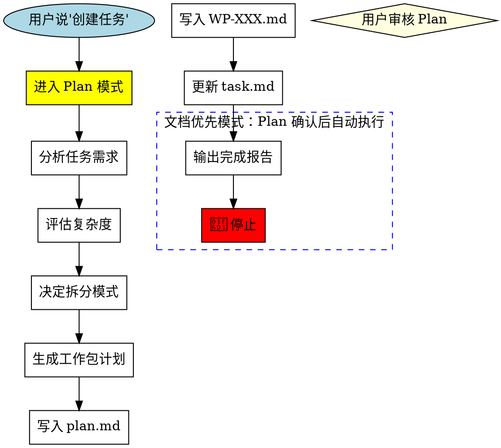

<STOP>
╔══════════════════════════════════════════════════════════════════════════════╗
║  🛑 MANDATORY STOP POINT - 文档优先模式                                      ║
║                                                                              ║
║  Plan 确认后，自动执行以下步骤：                                              ║
║  Step 7:  写入 docs/wp/WP-XXX.md                                            ║
║  Step 8:  更新 task.md（追加概览表行）                                       ║
║  Step 9:  输出简洁报告 → 🛑 停止                                             ║
║                                                                              ║
║  ⚠️ 这是自动流程，不需要用户再次确认                                         ║
║  ⚠️ bypassPermission 不影响此流程                                            ║
╚══════════════════════════════════════════════════════════════════════════════╝
</STOP>

<HARD-GATE>
╔══════════════════════════════════════════════════════════════════════════════╗
║  📝 文档优先模式 - Plan 确认后自动执行                                        ║
║                                                                              ║
║  Plan 确认后，你必须**立即**执行以下步骤：                                    ║
║                                                                              ║
║  Step 7:  写入 docs/wp/WP-XXX.md（完整工作包文档）                           ║
║  Step 8:  更新 task.md（追加概览表行）                                       ║
║  Step 9:  输出简洁报告 → 🛑 停止                                             ║
║                                                                              ║
║  ⚠️ 这是自动流程，不需要用户再次确认                                         ║
║  ⚠️ bypassPermission 不影响此流程                                            ║
║                                                                              ║
║  DO NOT:                                                                     ║
║  ❌ Write any code files (.gd, .js, etc.)                                   ║
║  ❌ Modify any scene files (.tscn) except documentation                     ║
║  ❌ Call human-checkpoint（Plan 确认已是人介入点）                           ║
╚══════════════════════════════════════════════════════════════════════════════╝
</HARD-GATE>

# Task Creator (任务创建器)

创建工作包定义 - **仅创建定义，不实现代码**。

## 核心原则

```
┌─────────────────────────────────────────────────────────────────┐
│  "创建任务" ≠ "执行任务"                                        │
│                                                                 │
│  用户说 "创建任务" = 只写文档，不写代码                         │
│  用户说 "执行任务" = 开始写代码实现                             │
│                                                                 │
│  这是两个完全独立的阶段，中间必须有人工确认！                   │
└─────────────────────────────────────────────────────────────────┘
```

### 简单任务处理规则

| 情况 | 正确行为 |
|------|----------|
| "创建任务：修复一个 typo" | ✅ 创建 WP-XXX，然后停止 |
| "创建任务：改一行代码" | ✅ 创建 WP-XXX，然后停止 |
| "创建任务：加一个日志" | ✅ 创建 WP-XXX，然后停止 |
| "创建任务：重命名变量" | ✅ 创建 WP-XXX，然后停止 |

**核心规则**：只要识别到"创建任务"意图，无论任务多简单，都必须：
1. 进入 Plan 模式
2. 创建工作包文档
3. 🛑 停止，等待用户确认

## When to Use

- 用户说 "创建任务" / "新建任务"
- 用户说 "添加任务" / "增加任务"

### 多窗口执行规划（可选功能）

当用户提示中包含 "按N个窗口规划" 时（如 "按2个窗口规划"、"按3个窗口规划"），
在完成报告（Step 9）中额外输出多窗口执行规划，将工作包分配到多个 Claude Code 窗口并行执行。

**关键词检测模式**: `按(\d+)个窗口规划`

---

## 🎯 快速模式 vs 深度模式

根据用户提示词自动选择模式：

| 用户提示词特征 | 模式 | Plan 阶段行为 |
|----------------|------|---------------|
| 包含"只写文档"、"不要执行"、"不具体执行"、"不要直接执行" | **快速模式** | 只定义任务，不分析代码 |
| 无上述关键词 | **深度模式** | 可自由分析代码、评估复杂度 |

### 快速模式（用户明确说"不要执行"时）

在 Plan 模式中，你只能：
- ✅ 确定工作包编号
- ✅ 写任务标题和目标（1-2句话）
- ✅ 写子任务列表（可选）
- ✅ 写验收标准（可选）

在 Plan 模式中，你**禁止**：
- ❌ 读取代码文件分析实现
- ❌ 检查代码是否存在
- ❌ 运行任何代码审计
- ❌ 做任何"执行阶段"才该做的工作

**规则**: 快速模式下，Plan 阶段只定义"做什么"，不分析"怎么做"或"是否已做"

### 深度模式（默认）

Plan 阶段可以自由进行：
- ✅ 读取代码分析依赖
- ✅ 评估任务复杂度
- ✅ 检查现有实现
- ✅ 设计拆分方案

### 多窗口规划模式

| 用户提示词特征 | 行为 |
|----------------|------|
| 包含 "按N个窗口规划" | Step 9 完成报告中附加多窗口执行规划 |
| 不包含上述关键词 | 正常流程，不输出多窗口规划 |

---

## 🆕 智能拆分系统

### 任务复杂度评估矩阵

| 维度 | 简单 (1分) | 中等 (2分) | 复杂 (3分) |
|------|-----------|-----------|-----------|
| 文件数 | ≤2 | 3-5 | >5 |
| 模块数 | 1 | 2-3 | >3 |
| 接口变更 | 无 | 有 | 新增接口 |
| 测试用例 | ≤5 | 6-15 | >15 |
| 预估AI时间 | ≤5min | 5-30min | >30min |

### 拆分规则

| 总分 | 拆分模式 | 说明 |
|------|----------|------|
| ≤6 | simple | 不拆分，单工作包 |
| 7-12 | standard | 标准拆分 (impl + test + verify + review) |
| >12 | fine-grained | 细粒度拆分 (多模块并行) |

### 工作包类型定义

| 类型后缀 | 职责 | 执行角色 | 验收标准 |
|----------|------|----------|----------|
| `-impl` | 代码实现 | 领域专家 (UI/战斗/效果) | 功能完成，可编译 |
| `-test` | 单元测试编写 | test-reviewer | 测试用例编写完成 |
| `-verify` | 测试验证（运行测试） | test-reviewer | **全部测试通过** |
| `-review` | 代码审查 | code-reviewer | **基础审查通过** |

### 拆分模式详解

#### 模式 A: simple (不拆分)
```
WP-XXX: [原任务]
├── 实现 + 自测
└── 角色: 领域专家
```

#### 模式 B: standard (标准拆分)
```
WP-XXX: [原任务] (父工作包)
├── WP-XXX-1-impl: 代码实现
│   └── 依赖: 无
├── WP-XXX-2-test: 单元测试编写
│   └── 依赖: WP-XXX-1-impl
├── WP-XXX-3-verify: 测试验证
│   └── 依赖: WP-XXX-2-test
└── WP-XXX-4-review: 代码审查
    └── 依赖: WP-XXX-3-verify
```

#### 模式 C: fine-grained (细粒度拆分)
```
WP-XXX: [原任务] (父工作包)
├── WP-XXX-1-impl-a: 实现模块A
├── WP-XXX-1-impl-b: 实现模块B
│   └── 依赖: WP-XXX-1-impl-a (如有依赖)
├── WP-XXX-2-test-a: 测试模块A
│   └── 依赖: WP-XXX-1-impl-a
├── WP-XXX-2-test-b: 测试模块B
│   └── 依赖: WP-XXX-1-impl-b
├── WP-XXX-3-verify: 测试验证
│   └── 依赖: WP-XXX-2-test-a, WP-XXX-2-test-b
└── WP-XXX-4-review: 代码审查
    └── 依赖: WP-XXX-3-verify
```

### 依赖关系图

```
┌──────────────────────────────────────────────────────────────┐
│                        依赖链模板                            │
│                                                              │
│   [impl] ──► [test] ──► [verify] ──► [review] ──► 完成     │
│                                                              │
│   并行实现时:                                                │
│   [impl-a] ──► [test-a] ──┐                                 │
│                            ├──► [verify] ──► [review]       │
│   [impl-b] ──► [test-b] ──┘                                 │
│                                                              │
└──────────────────────────────────────────────────────────────┘
```

## 🪟 多窗口执行规划系统

### 触发条件

在 Step 0 进入 Plan 模式前，检查用户提示中是否包含多窗口规划关键词：

**正则模式**: `按(\d+)个窗口规划`

匹配示例：
- "创建任务，按2个窗口规划" → 窗口数 = 2
- "创建任务 XXX，按3个窗口规划" → 窗口数 = 3
- "按1个窗口规划" → 窗口数 = 1（退化为单窗口，仍输出规划）

如果匹配到，将 `multi_window_count` 变量设置为提取的数字，在后续流程中传递。

### 规划时机

多窗口规划在 **Step 9（输出完成报告）** 中作为附加部分输出。
它依赖于已完成的工作包创建结果（包括所有子工作包和依赖关系）。

### 算法逻辑

#### 阶段 1: 收集依赖图

从已创建的工作包中收集所有子工作包及其依赖关系：

1. 枚举所有已创建的工作包（父工作包和子工作包）
2. 从每个工作包文档的 "依赖" 字段提取依赖关系
3. 构建有向无环图 (DAG)：
   - 节点 = 每个子工作包（如 WP-XXX-1-impl, WP-XXX-2-test）
   - 边 = 依赖关系（如 WP-XXX-2-test 依赖 WP-XXX-1-impl）

#### 阶段 2: 拓扑分层

使用拓扑排序确定执行层次：

```
1. 找出所有无依赖的节点 → Layer 0
2. 移除 Layer 0 节点，找出剩余中无依赖的 → Layer 1
3. 重复直到所有节点分配到层
4. 每个层内的节点互不依赖，可以并行执行
```

#### 阶段 3: 窗口分配

对每一层，将工作包分配到 N 个窗口中：

```
对每一层:
  1. 统计当前层的工作包数量
  2. 如果工作包数 <= N:
     - 每个窗口分配 0 或 1 个工作包，尽量均匀分布
  3. 如果工作包数 > N:
     - 按工作包 ID 排序
     - 轮询分配到 N 个窗口

窗口分配策略:
  - 同一父工作包的子工作包尽量分配到同一窗口（减少上下文切换）
  - 优先将无依赖的同类工作包分散到不同窗口（最大化并行度）
```

#### 阶段 4: 合并执行指令

对每个窗口，将分配的工作包合并为 `skill-agent-dispatcher` 指令：

- **连续编号合并**: WP-001, WP-002, WP-003 → `WP-001~WP-003`
- **非连续编号枚举**: WP-001, WP-005 → `WP-001,WP-005`
- **混合**: WP-001, WP-002, WP-005 → `WP-001~WP-002,WP-005`

### 关键设计决策

**多窗口规划输出引用父工作包 ID（非子工作包）**。

原因：`skill-agent-dispatcher` 已支持子工作包拆分执行，会自动创建正确的依赖链。
多窗口规划的层级结构已根据子工作包依赖关系捕获了并行化结构。

### 约束规则

1. **跨窗口无依赖**: 同一阶段内不同窗口的工作包不能有直接依赖关系
2. **阶段间串行**: 后一阶段必须等前一阶段所有窗口完成
3. **窗口数上限**: 实际窗口数 = min(用户指定窗口数, 当前层最大并行度)
4. **单工作包退化为独立阶段**: 如果某层只有 1 个工作包，直接作为单窗口阶段输出
5. **空窗口省略**: 窗口数 > 工作包数时，省略空窗口

### 边缘情况处理

| 情况 | 处理策略 |
|------|----------|
| 窗口数 = 1 | 有效；输出单窗口规划（顺序阶段） |
| 窗口数 > 工作包数 | 部分窗口为空，省略空窗口 |
| 所有工作包 simple 模式 | 每个 WP 视为独立节点，按跨 WP 依赖分层 |
| 无依赖关系 | 所有 WP 在 Layer 0，均匀分配到 N 个窗口 |
| 单个 fine-grained 工作包 | 分层适用于子工作包；impl 并行，test 等待 impl |
| 循环依赖 | 报错输出；多窗口规划中止，其余任务正常完成 |

## Forbidden Thoughts

| Thought | Reality |
|---------|---------|
| "用户让我创建任务，所以我可以开始实现" | ❌ 创建≠执行，必须等待 |
| "Plan 确认后可以继续执行" | ❌ Plan 确认只允许文档更新，然后必须停止 |
| "这个任务很简单，不用等" | ❌ 任何任务都要等待 |
| "用户应该想让我立即执行" | ❌ 不要假设，必须确认 |
| "用户选择了 bypassPermission" | ❌ bypassPermission 不影响停止点 |
| "用户清除了上下文" | ❌ 清除上下文 ≠ 授权执行代码 |
| "Plan 已经确认了，可以开始写代码" | ❌ Plan 确认后只写文档，然后停止，不执行代码 |
| "调用 ExitPlanMode 工具" | ❌ 不要调用 ExitPlanMode，让用户在 Plan 界面确认即可 |
| "用户选了 bypass，可以跳过文档更新" | ❌ bypass 只跳过权限确认，不跳过文档更新步骤 |
| "这个任务只有一行代码" | ❌ 一行代码也要创建工作包 |
| "这不需要工作包，直接改就行" | ❌ 任何任务都要创建工作包 |
| "用户应该想让我直接做" | ❌ 必须等待用户明确说"执行" |
| "任务太简单，不值得创建工作包" | ❌ 简单任务也要创建工作包 |
| "多窗口规划会自动执行工作包" | ❌ 多窗口规划只输出执行指令文本，不触发任何执行。用户需手动复制指令到各窗口 |

---

## 上下文窗口管理

仅在深度模式下生效。快速模式不读取文件，无需分块。

### 预读估算协议

1. 查看文件顶部的 `<!-- CONTEXT-CONFIG -->` 获取限制参数
2. 先用 Glob 发现文件，用 Bash `wc -l` 估算行数
3. 估算公式: 每行代码 ≈ 10 tokens，每行文本 ≈ 5 tokens
4. 可用预算 = max_tokens - safety_margin

### 读取策略决策树

| 文件估算行数 | 策略 |
|-------------|------|
| ≤ thresholds.small (200行) | 直接用 Read 工具读取整个文件 |
| thresholds.small ~ thresholds.medium (200-800行) | 分块读取: Read(offset, limit=chunk_lines) |
| > thresholds.medium (800行) | Grep 扫描关键模式 → 定位行范围 → Read 目标段 |
| 多文件合计超预算 | 排序优先级 → 读高优 → 低优用 Grep |

### 分块读取协议

1. **首块**(1 ~ chunk_lines): 建立"结构地图"（类/函数/节标题位置）
2. **后续块**: 根据结构地图判断是否包含相关内容
3. **提前终止**: 已获得足够信息时停止读取，不读完整文件
4. **跨块引用**: 记录依赖但不回读

### 语义边界规则（优先级从高到低）

1. 函数/方法边界 - 不在函数体中间断开
2. 类边界 - 不在类定义中间断开
3. Markdown 节标题 - 在 `##`/`###` 处断开
4. 代码块边界 - 在 `{ }` 之间断开
5. 行边界 - 最后手段

### 部分分析的合并

置信度标注:
- **[HIGH]** 基于完整直接读取
- **[MEDIUM]** 基于部分读取 + 结构推断
- **[LOW]** 仅基于 Grep 结果

在 Plan 中包含"上下文缺口"子节:
```
## 上下文缺口
| 文件 | 未读部分 | 影响 | 建议 |
|------|----------|------|------|
```

### 任务创建专属规则

1. 用 Glob 找到所有相关文件后再开始读取
2. 估算所有文件总大小
3. 超预算时: 只读任务描述直接提到的文件，其余用 Grep
4. 复杂度评估基于结构分析 + 部分读取
5. 在 Plan 输出中标注哪些文件仅部分分析

---

## 核心流程

**触发**: 用户说 "创建任务"

**允许的操作**:
- ✅ 读取项目文件（分析依赖）
- ✅ 写入 `docs/wp/WP-XXX.md`
- ✅ 更新 `task.md`（追加概览表行）

**禁止的操作**:
- ❌ 创建/修改任何 `.gd` 文件
- ❌ 创建/修改任何 `.tscn` 场景文件
- ❌ 创建/修改任何资源文件 `.tres`
- ❌ 执行任何代码实现
- ❌ 调用 human-checkpoint（Plan 确认已是人介入点）

**结束标志**: 输出完成报告 → 🛑 停止

---

## Flow Diagram



---

## Execution Steps

### Step 0: 进入 Plan 模式（必须首先执行）

**⚠️ 立即调用 `EnterPlanMode` 工具进入 Plan 模式！**

不要跳过这一步。不要直接开始分析。必须先进入 Plan 模式。

### Step 1-6: Plan Mode 阶段

在 Plan 模式中完成以下工作：

1. **分析任务需求** - 理解用户描述的任务内容
   1.5. **🪟 检测多窗口规划** (可选) - 如果用户提示包含 "按N个窗口规划"，
       提取窗口数量 N，设置 `multi_window_count = N`，后续在报告中输出多窗口规划
2. **获取当前工作包编号** - 读取 `task.md` 找到最大 WP 编号
   > **注意**: `WP-XXX` 中的 `XXX` 为数字编号占位符，无固定位数限制。
   > 编号范围涵盖 WP-1 到 WP-9999+，AI 应使用 task.md 中实际的最大编号 +1。
3. **🆕 评估任务复杂度** - 使用复杂度评估矩阵计算总分
4. **🆕 决定拆分模式** - 根据总分选择 simple/standard/fine-grained
5. **拆分子任务** - 按照选定的拆分模式生成子工作包
6. **生成工作包计划** - 包含任务列表、验收标准、测试用例、依赖关系

### Step 6.5: 请求用户确认 Plan

**⚠️ 必须使用 `AskUserQuestion` 工具请求用户确认！**

提供以下选项：
- **确认创建** - 批准计划，开始写入文档
- **需要修改** - 计划需要调整（请在备注中说明）
- **自由输入** - 提供额外的反馈或要求

❌ 不要调用 ExitPlanMode 工具（这会触发简化界面，不提供选项）
✅ 用户确认后，继续执行 Step 7-9 文档写入

### Step 1.5: 评估任务复杂度（详细）

**评估维度**：
```
复杂度评分表:
┌────────────────────┬───────────────────────────────────────┐
│ 维度               │ 评分标准                              │
├────────────────────┼───────────────────────────────────────┤
│ 文件影响范围       │ ≤2文件=1分, 3-5文件=2分, >5文件=3分   │
│ 模块数量           │ 1模块=1分, 2-3模块=2分, >3模块=3分    │
│ 接口变更程度       │ 无变更=1分, 修改=2分, 新增=3分        │
│ 预估测试用例数     │ ≤5个=1分, 6-15个=2分, >15个=3分       │
│ 预估AI时间         │ ≤5min=1分, 5-30min=2分, >30min=3分    │
└────────────────────┴───────────────────────────────────────┘
```

**决策规则**：
- 总分 ≤6: 使用模式 A（simple，不拆分）
- 总分 7-12: 使用模式 B（standard，标准拆分）
- 总分 >12: 使用模式 C（fine-grained，细粒度拆分）

### Step 2.5: 生成子工作包（如需拆分）

如果需要拆分，按以下顺序生成：

1. **实现工作包** (`WP-XXX-1-impl`)
   > **注意**: `XXX` 为实际数字编号（如 WP-56, WP-999, WP-1000），非固定位数。
   - 包含主要代码实现
   - 角色匹配: 根据任务关键词匹配领域专家

2. **测试工作包** (`WP-XXX-2-test`)
   - 依赖: 实现工作包
   - 角色匹配: test-reviewer

3. **验证工作包** (`WP-XXX-3-verify`)
   - 依赖: 测试工作包
   - 角色: test-reviewer
   - 职责: 运行测试，确保全部通过

4. **审查工作包** (`WP-XXX-4-review`)
   - 依赖: 验证工作包
   - 角色: code-reviewer
   - 职责: 审查代码质量、架构合规

### Step 7-9: 文档输出阶段（Plan 确认后，自动执行）

<POST-PLAN-MANDATORY>
╔══════════════════════════════════════════════════════════════════════════════╗
║  📝 文档优先模式 - Plan 确认后自动执行                                        ║
║                                                                              ║
║  Plan 确认后，你必须**立即**执行以下步骤：                                    ║
║                                                                              ║
║  Step 7:  写入 docs/wp/WP-XXX.md（**完整同步 Plan 内容**）                   ║
║  Step 8:  更新 task.md（追加概览表行）                                       ║
║  Step 9:  输出简洁报告 → 🛑 停止                                             ║
║                                                                              ║
║  ⚠️ 这是自动流程，不需要用户再次确认                                         ║
║  ⚠️ bypassPermission 不影响此流程                                            ║
╚══════════════════════════════════════════════════════════════════════════════╝
</POST-PLAN-MANDATORY>

**⚠️ 此阶段只允许更新文档文件，禁止任何代码修改！**

7. **写入工作包文档** - 创建 `docs/wp/WP-XXX.md`
   - ⚠️ **关键**: 必须将 Plan 文档的**完整内容**同步到工作包文档
   - 包括：Context、问题分析、实施计划 Step 1-N、关键文件、验收标准
   - 确保 Subagent 无需访问 Plan 文档即可获取完整上下文

8. **更新任务清单** - 在 `task.md` 概览表添加新行
9. **输出简洁报告** - 使用下方格式。如果 `multi_window_count` 已设置，
   在报告末尾附加多窗口执行规划（见"多窗口执行规划报告格式"）。然后 **🛑 停止**

---

## Completion Report Format

文档更新完成后，输出以下格式的简洁报告：

### 简单任务报告（无拆分）

```markdown
✅ 任务创建完成

📦 **工作包**: WP-XXX - 工作包名称
📊 **优先级**: P0/P1/P2
⏱️ **预估AI时间**: Xmin
📋 **子任务数**: X 个
🧪 **测试用例**: X 个
📊 **复杂度**: X分 (simple模式)

📁 **已更新文档**:
- docs/wp/WP-XXX.md
- task.md

🛑 **任务创建完成，等待您的下一步指示**
```

### 拆分任务报告（standard/fine-grained模式）

<!-- XXX = 数字编号占位符（如 WP-56, WP-1000），非固定位数 -->

```markdown
✅ 任务创建完成（已拆分）

📦 **父工作包**: WP-XXX - 工作包名称
📊 **优先级**: P0/P1/P2
⏱️ **预估总AI时间**: Xmin
📊 **复杂度**: X分 (standard/fine-grained模式)

📋 **子工作包列表**:
| ID | 类型 | 职责 | 依赖 | 角色 |
|----|------|------|------|------|
| WP-XXX-1-impl | 实现 | 核心代码 | - | 领域专家 |
| WP-XXX-2-test | 测试 | 单元测试 | WP-XXX-1-impl | test-reviewer |
| WP-XXX-3-verify | 验证 | 测试验证 | WP-XXX-2-test | test-reviewer |
| WP-XXX-4-review | 审查 | 代码审查 | WP-XXX-3-verify | code-reviewer |

📁 **已更新文档**:
- docs/wp/WP-XXX.md (父工作包)
- docs/wp/WP-XXX-1-impl.md
- docs/wp/WP-XXX-2-test.md
- docs/wp/WP-XXX-3-verify.md
- docs/wp/WP-XXX-4-review.md
- task.md

🛑 **任务创建完成，等待您的下一步指示**
```

**输出报告后，直接 🛑 停止**

### 多窗口执行规划报告（附加在完成报告之后）

仅当检测到 "按N个窗口规划" 关键词时，在完成报告的 `🛑 停止` 标记之前输出。

```markdown
---

## 🪟 多窗口执行规划 (按 {N} 个窗口)

### 阶段1 (可并行)
| 窗口 | 执行指令 |
|------|----------|
| 窗口1 | `/skill-agent-dispatcher WP-170~WP-174` |
| 窗口2 | `/skill-agent-dispatcher WP-175~WP-178` |

### 阶段2 (串行 — 依赖阶段1全部完成)
| 窗口 | 执行指令 |
|------|----------|
| 窗口1 | `/skill-agent-dispatcher WP-179` |

**使用方法**: 在 {N} 个 Claude Code 窗口中按阶段顺序执行。同阶段内不同窗口可并行，阶段间必须串行等待。
```

---

## 🛑 MANDATORY STOP BEHAVIOR

**文档优先模式：Plan 确认后自动写文档，然后停止。**

```
╔══════════════════════════════════════════════════════════════════╗
║  📝 文档优先模式                                                  ║
║                                                                  ║
║  Plan 确认后：                                                    ║
║  ✅ 自动写入 docs/wp/WP-XXX.md                                   ║
║  ✅ 自动更新 task.md                                             ║
║  ✅ 输出简洁报告                                                  ║
║  ✅ 🛑 停止等待用户下一步指示                                     ║
║                                                                  ║
║  DO NOT (绝对禁止):                                               ║
║  ❌ 调用 human-checkpoint（Plan 确认已是人介入点）                ║
║  ❌ 自动开始代码实现                                              ║
║  ❌ 开始写任何代码文件                                            ║
╚══════════════════════════════════════════════════════════════════╝
```

---

## 文件路径约定

| 文件类型 | 允许在本 Skill 中修改 |
|----------|----------------------|
| `docs/wp/WP-XXX.md` | ✅ 允许 |
| `task.md` | ✅ 允许 |
| `.claude/plan.md` | ✅ 允许 |
| `scripts/**/*.gd` | ❌ 禁止 |
| `scenes/**/*.tscn` | ❌ 禁止 |
| `resources/**/*.tres` | ❌ 禁止 |
| 其他任何代码文件 | ❌ 禁止 |

---

## 示例

### 输入
```
创建任务 - 实现成就系统
```

### 正确执行流程（文档优先模式）

**Plan 确认后自动执行**:
```
AI: [写入 docs/wp/WP-014.md]
    [更新 task.md]
    [输出完成报告]
    🛑 停止

✅ 任务创建完成
📦 WP-014 成就系统
...

🛑 任务创建完成，等待您的下一步指示
```

### 错误执行流程 ❌

```
AI: [Plan 确认后]
    [更新文档]
    [自动开始写代码]  ← ❌ 错误！必须等待用户说"执行"
```

---

## 相关文档

- 工作包文档: `docs/wp/WP-XXX.md`
- 任务清单: `task.md` (主索引)
- 归档: `docs/archive/` (历史工作包和活动日志)

> ⚠️ `PROGRESS.md` 已于 2026-03-18 废弃，新记录请使用 `task.md`
> ⚠️ `docs/core/12_工作包清单.md` 已于 2026-03-17 废弃

---

## 同步机制

### 创建工作包时
1. 读取 `task.md` 获取最新 WP 编号
2. 写入 `docs/wp/WP-XXX.md`
3. 追加到 `task.md` 概览表
4. 验证: 读取 task.md 确认新条目存在

### 完成工作包时（completion-report）
1. 更新 `task.md` 最近完成区域
2. 更新 `task.md` 快速概览统计
3. 验证: 确认状态从 📋 → ✅

---

## 文档同步验证

创建/更新工作包后，必须验证：

```bash
# 验证 task.md 包含新工作包
grep "WP-XXX" task.md

# 验证 docs/wp/ 目录存在对应文档
ls docs/wp/WP-XXX.md
```

**验证失败时**: 必须立即修复，不可继续执行

---

## 工作包文档模板

### 父工作包模板（拆分模式）

<!-- XXX = 数字编号占位符（如 WP-56, WP-1000），非固定位数 -->

```markdown
# WP-XXX: [任务名称]

## 🤖 Subagent 读取指令

> **重要**: 此文档包含完整的任务上下文。执行前请阅读以下内容：
> - **问题分析**: 理解任务的背景和问题点
> - **实施计划**: 按 Step 顺序执行
> - **关键文件**: 需要修改的文件列表
> - **验收标准**: 任务完成的检查清单

## 基本信息

| 属性 | 值 |
|------|-----|
| **优先级** | P0/P1/P2 |
| **预估AI时间** | Xmin |
| **拆分模式** | simple/standard/fine-grained |
| **状态** | 📋 待执行 / 🔄 进行中 / ✅ 已完成 |

## 复杂度评估

| 维度 | 评分 | 说明 |
|------|------|------|
| 文件影响范围 | 1-3 | 具体说明 |
| 模块数量 | 1-3 | 具体说明 |
| 接口变更程度 | 1-3 | 具体说明 |
| 测试用例预估 | 1-3 | 具体说明 |
| 预估AI时间 | 1-3 | 具体说明 |
| **总分** | X | 模式: standard |

## 子工作包列表

| ID | 类型 | 职责 | 依赖 | 执行角色 | 状态 |
|----|------|------|------|----------|------|
| WP-XXX-1-impl | 实现 | 核心代码 | - | 领域专家 | 📋 |
| WP-XXX-2-test | 测试 | 单元测试 | WP-XXX-1-impl | test-reviewer | 📋 |
| WP-XXX-3-verify | 验证 | 测试验证 | WP-XXX-2-test | test-reviewer | 📋 |
| WP-XXX-4-review | 审查 | 代码审查 | WP-XXX-3-verify | code-reviewer | 📋 |

## 依赖关系图


## 目标

[任务的整体目标描述]

## 验收标准

- [ ] 所有子工作包完成
- [ ] 全部测试通过
- [ ] 代码审查通过
```

### 子工作包模板

```markdown
# WP-XXX-N-{type}: [子任务名称]

## 🤖 Subagent 读取指令

> **重要**: 执行此任务前，请先阅读父工作包文档获取完整上下文：
> - 父工作包: `docs/wp/WP-XXX.md`
> - 包含: 问题分析、实施计划、关键文件、验收标准

## 基本信息

| 属性 | 值 |
|------|-----|
| **类型** | impl/test/verify/review |
| **父工作包** | WP-XXX |
| **依赖** | WP-XXX-(N-1)-{type} (如有) |
| **执行角色** | 领域专家/test-reviewer/code-reviewer |
| **状态** | 📋 待执行 / 🔄 进行中 / ✅ 已完成 |

## 职责

[具体职责描述]

## 任务清单

- [ ] 任务项 1
- [ ] 任务项 2
- [ ] 任务项 3

## 验收标准

- [ ] 验收标准 1
- [ ] 验收标准 2

## 关键文件

- `path/to/file1.gd`
- `path/to/file2.gd`
```

---

## 角色匹配规则

### 核心角色匹配

| 任务关键词 | 匹配角色 |
|------------|----------|
| 架构、设计、结构、模块、接口 | architect |
| 实现、编码、开发、修复、重构 | implementer |
| 测试、验证、检查、单元测试 | tester |
| 文档、说明、注释、README | documenter |
| 调度、协调、监控、分配 | coordinator |

### 领域角色匹配（由项目模板扩展）

| 任务关键词 | 匹配角色 |
|------------|----------|
| 前端、UI、组件、样式、页面 | frontend-dev |
| 后端、API、服务、数据库、接口 | backend-dev |
| 部署、CI/CD、Docker、容器 | devops |
| 场景、节点、tscn、UI（Godot） | godot-scene-expert |
| 脚本、调试、错误、Error（Godot） | godot-script-expert |

### 固定角色

| 工作包类型 | 执行角色 |
|------------|----------|
| -test | tester |
| -verify | tester |
| -review | architect 或 reviewer |
